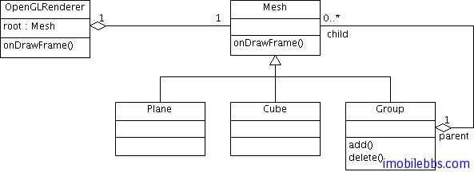
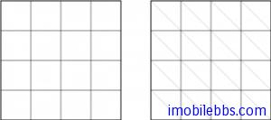
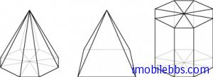

# 真正的 3D 图形  
  
前面的例子尽管使用了 OpenGL ES 3D 图形库，但绘制的还是二维图形（平面上的正方形）。Mesh（网格，三角面）是构成空间形体的基本元素，前面的正方形也是有两个 Mesh 构成的。本篇将介绍使用 Mesh 构成四面体，椎体等基本空间形体。

## Design 设计

在使用 OpenGL 框架时一个好的设计原则是使用 “Composite Pattern”，本篇采用如下设计：
  
  

### Mesh

首先定义一个基类 Mesh，所有空间形体最基本的构成元素为 Mesh（三角形网格） ，其基本定义如下：

```
public class Mesh {
 // Our vertex buffer.
 private FloatBuffer verticesBuffer = null;
 // Our index buffer.
 private ShortBuffer indicesBuffer = null;
 // The number of indices.
 private int numOfIndices = -1;
 // Flat Color
 private float[] rgba
 = new float[] { 1.0f, 1.0f, 1.0f, 1.0f };
 // Smooth Colors
 private FloatBuffer colorBuffer = null;
 // Translate params.
 public float x = 0;
 public float y = 0;
 public float z = 0;
 // Rotate params.
 public float rx = 0;
 public float ry = 0;
 public float rz = 0;
 public void draw(GL10 gl) {
 // Counter-clockwise winding.
 gl.glFrontFace(GL10.GL_CCW);
 // Enable face culling.
 gl.glEnable(GL10.GL_CULL_FACE);
 // What faces to remove with the face culling.
 gl.glCullFace(GL10.GL_BACK);
 // Enabled the vertices buffer for writing and
 //to be used during
 // rendering.
 gl.glEnableClientState(GL10.GL_VERTEX_ARRAY);
 // Specifies the location and data format
 //of an array of vertex
 // coordinates to use when rendering.
 gl.glVertexPointer(3, GL10.GL_FLOAT, 0, verticesBuffer);
 // Set flat color
 gl.glColor4f(rgba[0], rgba[1], rgba[2], rgba[3]);
 // Smooth color
 if (colorBuffer != null) {
 // Enable the color array buffer to be
 //used during rendering.
 gl.glEnableClientState(GL10.GL_COLOR_ARRAY);
 gl.glColorPointer(4, GL10.GL_FLOAT, 0, colorBuffer);
 }
 gl.glTranslatef(x, y, z);
 gl.glRotatef(rx, 1, 0, 0);
 gl.glRotatef(ry, 0, 1, 0);
 gl.glRotatef(rz, 0, 0, 1);
 // Point out the where the color buffer is.
 gl.glDrawElements(GL10.GL_TRIANGLES, numOfIndices,
 GL10.GL_UNSIGNED_SHORT, indicesBuffer);
 // Disable the vertices buffer.
 gl.glDisableClientState(GL10.GL_VERTEX_ARRAY);
 // Disable face culling.
 gl.glDisable(GL10.GL_CULL_FACE);
 }
 protected void setVertices(float[] vertices) {
 // a float is 4 bytes, therefore
 //we multiply the number if
 // vertices with 4.
 ByteBuffer vbb
 = ByteBuffer.allocateDirect(vertices.length * 4);
 vbb.order(ByteOrder.nativeOrder());
 verticesBuffer = vbb.asFloatBuffer();
 verticesBuffer.put(vertices);
 verticesBuffer.position(0);
 }
 protected void setIndices(short[] indices) {
 // short is 2 bytes, therefore we multiply
 //the number if
 // vertices with 2.
 ByteBuffer ibb
 = ByteBuffer.allocateDirect(indices.length * 2);
 ibb.order(ByteOrder.nativeOrder());
 indicesBuffer = ibb.asShortBuffer();
 indicesBuffer.put(indices);
 indicesBuffer.position(0);
 numOfIndices = indices.length;
 }
 protected void setColor(float red, float green,
 float blue, float alpha) {
 // Setting the flat color.
 rgba[0] = red;
 rgba[1] = green;
 rgba[2] = blue;
 rgba[3] = alpha;
 }
 protected void setColors(float[] colors) {
 // float has 4 bytes.
 ByteBuffer cbb
 = ByteBuffer.allocateDirect(colors.length * 4);
 cbb.order(ByteOrder.nativeOrder());
 colorBuffer = cbb.asFloatBuffer();
 colorBuffer.put(colors);
 colorBuffer.position(0);
 }
}  
```  

- setVertices 允许子类重新定义顶点坐标。
- setIndices 允许子类重新定义顶点的顺序。
- setColor /setColors 允许子类重新定义颜色。
- x,y,z 定义了平移变换的参数。
- rx,ry,rz 定义旋转变换的参数。  
  
### Plane
 
有了 Mesh 定义之后，再来构造 Plane，plane 可以有宽度，高度和深度，宽度定义为沿 X 轴方向的长度，深度定义为沿 Z 轴方向长度，高度为 Y 轴方向。  
  


Segments 为形体宽度，高度，深度可以分成的份数。 Segments 在构造一个非均匀分布的 Surface 特别有用，比如在一个游戏场景中，构造地貌，使的Z轴的值随机分布在 -0.1 到 0.1 之间，然后给它渲染好看的材质就可以造成地图凹凸不平的效果。  
  


上面图形中 Segments 为一正方形，但在 OpenGL 中我们需要使用三角形，所有需要将 Segments 分成两个三角形。为 Plane 定义两个构造函数：
  
```
// Let you decide the size of the plane but still only one segment.
public Plane(float width, float height)
```  
  
```
// For alla your settings.
public Plane(float width, float height, int widthSegments, int heightSegments)
```  

比如构造一个 1 unit 宽和 1 unit 高，并分成 4 个 Segments，使用图形表示如下：  
  


左边的图显示了 segments ,右边的图为需要创建的 Face（三角形）。

Plane 类的定义如下：

```
public class Plane extends Mesh {
 public Plane() {
 this(1, 1, 1, 1);
 }
 public Plane(float width, float height) {
 this(width, height, 1, 1);
 }
 public Plane(float width, float height, int widthSegments,
 int heightSegments) {
 float[] vertices
 = new float[(widthSegments + 1)
 * (heightSegments + 1) * 3];
 short[] indices
 = new short[(widthSegments + 1)
 * (heightSegments + 1)* 6];
 float xOffset = width / -2;
 float yOffset = height / -2;
 float xWidth = width / (widthSegments);
 float yHeight = height / (heightSegments);
 int currentVertex = 0;
 int currentIndex = 0;
 short w = (short) (widthSegments + 1);
 for (int y = 0; y < heightSegments + 1; y++) {
 for (int x = 0; x < widthSegments + 1; x++) {
 vertices[currentVertex] = xOffset + x * xWidth;
 vertices[currentVertex + 1] = yOffset + y * yHeight;
 vertices[currentVertex + 2] = 0;
 currentVertex += 3;
 int n = y * (widthSegments + 1) + x;
 if (y < heightSegments && x < widthSegments) {
 // Face one
 indices[currentIndex] = (short) n;
 indices[currentIndex + 1] = (short) (n + 1);
 indices[currentIndex + 2] = (short) (n + w);
 // Face two
 indices[currentIndex + 3] = (short) (n + 1);
 indices[currentIndex + 4] = (short) (n + 1 + w);
 indices[currentIndex + 5] = (short) (n + 1 + w - 1);
 currentIndex += 6;
 }
 }
 }
 setIndices(indices);
 setVertices(vertices);
 }
}  
```  

### Cube

下面来定义一个正方体（Cube），为简单起见，这个四面体只可以设置宽度，高度，和深度，没有和 Plane 一样提供 Segments 支持。

```
public class Cube extends Mesh {
 public Cube(float width, float height, float depth) {
 width  /= 2;
 height /= 2;
 depth  /= 2;
 float vertices[] = { -width, -height, -depth, // 0
 width, -height, -depth, // 1
 width,  height, -depth, // 2
 -width,  height, -depth, // 3
 -width, -height,  depth, // 4
 width, -height,  depth, // 5
 width,  height,  depth, // 6
 -width,  height,  depth, // 7
 };
 short indices[] = { 0, 4, 5,
 0, 5, 1,
 1, 5, 6,
 1, 6, 2,
 2, 6, 7,
 2, 7, 3,
 3, 7, 4,
 3, 4, 0,
 4, 7, 6,
 4, 6, 5,
 3, 0, 1,
 3, 1, 2, };
 setIndices(indices);
 setVertices(vertices);
 }
}  
```  

### Group

Group 可以用来管理多个空间几何形体，如果把 Mesh 比作 Android 的 View ,Group 可以看作 Android 的 ViewGroup，Android 的 View 的设计也是采用的 “Composite Pattern”。

Group 的主要功能是把针对 Group 的操作（如draw) 分发到 Group 中的每个成员对应的操作（如draw)。

Group 定义如下：

```
public class Group extends Mesh {
 private Vector<Mesh> children = new Vector<Mesh>();
 @Override
 public void draw(GL10 gl) {
 int size = children.size();
 for( int i = 0; i < size; i++)
 children.get(i).draw(gl);
 }
 /**
 * @param location
 * @param object
 * @see java.util.Vector#add(int, java.lang.Object)
 */
 public void add(int location, Mesh object) {
 children.add(location, object);
 }
 /**
 * @param object
 * @return
 * @see java.util.Vector#add(java.lang.Object)
 */
 public boolean add(Mesh object) {
 return children.add(object);
 }
 /**
 *
 * @see java.util.Vector#clear()
 */
 public void clear() {
 children.clear();
 }
 /**
 * @param location
 * @return
 * @see java.util.Vector#get(int)
 */
 public Mesh get(int location) {
 return children.get(location);
 }
 /**
 * @param location
 * @return
 * @see java.util.Vector#remove(int)
 */
 public Mesh remove(int location) {
 return children.remove(location);
 }
 /**
 * @param object
 * @return
 * @see java.util.Vector#remove(java.lang.Object)
 */
 public boolean remove(Object object) {
 return children.remove(object);
 }
 /**
 * @return
 * @see java.util.Vector#size()
 */
 public int size() {
 return children.size();
 }
}  
```  

## 其它建议

上面我们定义里 Mesh, Plane, Cube 等基本空间几何形体，对于构造复杂图形（如人物），可以预先创建一些通用的几何形体，如果在组合成较复杂的形体。除了上面的基本形体外，可以创建如 Cone，Pryamid, Cylinder 等基本形体以备后用。  
  


本例示例代码[下载](http://www.imobilebbs.com/download/android/opengles/Tutorial_Part_V.zip)，显示结果如下：  
  


