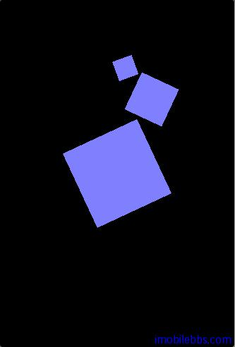
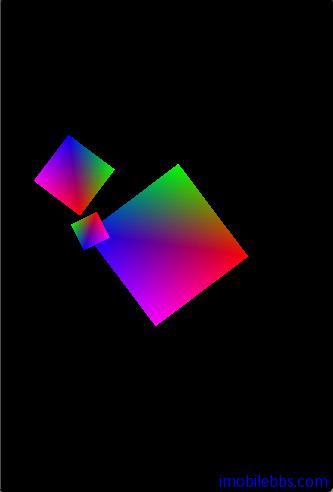

# 添加颜色  

前面的例子显示的正方形都是白色，看其来不是很吸引人，本篇介绍如何给 Mesh（网格）添加颜色。OpenGL ES 使用颜色是我们熟知的 RGBA 模式（红，绿，蓝，透明度）。

颜色的定义通常使用 Hex 格式 0xFF00FF 或十进制格式(255,0,255)， 在 OpenGL 中却是使用 0…1 之间的浮点数表示。0 为 0，1 相当于 255（0xFF)。

最简单的上色方法叫做顶点着色 (Vertxt coloring)，可以使用单色，也可以定义颜色渐变或者使用材质（类同于二维图形中各种 Brush 类型）。

## Flat coloring（单色）

是通知 OpenGL 使用单一的颜色来渲染，OpenGL 将一直使用指定的颜色来渲染直到你指定其它的颜色。

指定颜色的方法为
  
```
public abstract void glColor4f(float red, float green, float blue, float alpha)。   
```

缺省的 red,green,blue 为 1，代表白色。这也是为什么前面显示的正方形都是白色的缘故。

我们创建一个新的类为 FlatColoredSquare，作为 Sequare 的子类，将它的 draw 重定义如下：

```
public void draw(GL10 gl) {
 gl.glColor4f(0.5f, 0.5f, 1.0f, 1.0f);
 super.draw(gl);
}  
```  

将 OpenGLRenderer 的 square 的类型改为 FlatColoredSquare。

```  
private FlatColoredSquare square=new FlatColoredSquare();  
```  

编译运行，正方形颜色变成了蓝色：  
  
 

## Smooth coloring （平滑颜色过渡）

当给每个顶点定义一个颜色时，OpenGL 自动为不同顶点颜色之间生成中间过渡颜色（渐变色）。

在项目中添加一个 SmoothColoredSquare 类，作为 Square 子类，为每个顶点定义一个颜色值。

```
// The colors mapped to the vertices.
float[] colors = {
 1f, 0f, 0f, 1f, // vertex 0 red
 0f, 1f, 0f, 1f, // vertex 1 green
 0f, 0f, 1f, 1f, // vertex 2 blue
 1f, 0f, 1f, 1f, // vertex 3 magenta
};  
```  

颜色定义的顺序和顶点的顺序是一致的。为了提高性能，和顶点坐标一样，我们也把颜色数组放到Buffer 中：

```
// float has 4 bytes, colors (RGBA) * 4 bytes
ByteBuffer cbb
 = ByteBuffer.allocateDirect(colors.length * 4);
cbb.order(ByteOrder.nativeOrder());
colorBuffer = cbb.asFloatBuffer();
colorBuffer.put(colors);
colorBuffer.position(0);  
```  

最后修改 draw 方法，如下：

```
public void draw(GL10 gl) {
gl.glVertexPointer(3, GL10.GL_FLOAT, 0, vertexBuffer);
// Enable the color array buffer to be
//used during rendering.
gl.glEnableClientState(GL10.GL_COLOR_ARRAY);
// Point out the where the color buffer is.
gl.glColorPointer(4, GL10.GL_FLOAT, 0, colorBuffer);
super.draw(gl);
// Disable the color buffer.
gl.glDisableClientState(GL10.GL_COLOR_ARRAY);
}   
```  

将 OpenGLRenderer 中的 Square 类型改成 SmoothColoredSquare，编译运行结果如下：
  
   

本地示例代码[下载](http://www.imobilebbs.com/download/android/opengles/OpenGLESTutorial3)