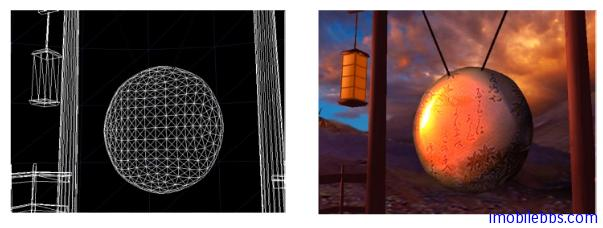
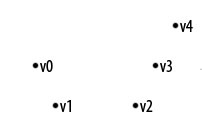
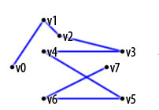
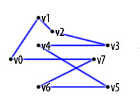
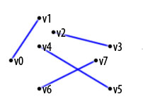
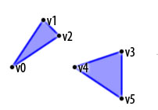
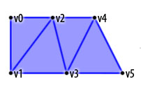
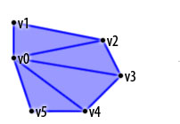
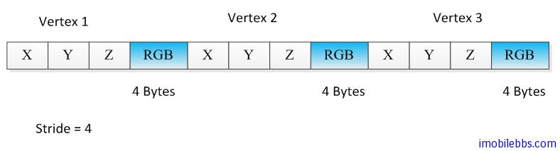
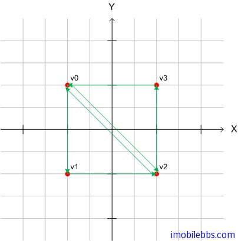

# 基本几何图形定义  
  
在前面 [Android OpenGL ES 开发教程(7)：创建实例应用 OpenGLDemos 程序框架](http://www.imobilebbs.com/wordpress/archives/1892) 我们创建了示例程序的基本框架，并提供了一个 “Hello World” 示例，将屏幕显示为红色。

本例介绍 OpenGL ES 3D 图形库支持的几种基本几何图形，本篇部分内容与 [Android OpenGL ES 简明开发教程三：3D 绘图基本概念](http://www.imobilebbs.com/wordpress/archives/1512) 类似。

通常二维图形库可以绘制点，线，多边形，圆弧，路径等等。OpenGL ES 支持绘制的基本几何图形分为三类：点，线段，三角形。也就是说 OpenGL ES 只能绘制这三种基本几何图形。任何复杂的2D或是3D图形都是通过这三种几何图形构造而成的。

比如下图复杂的 3D 图形，都有将其分割成细小的三角形面而构成的。然后通过上色 (Color)，添加材质 (Texture)，再添加光照（lighting)，构造3D效果的图形：  
  


点，线段，三角形都是通过顶点来定义的，也就是顶点数组来定义。对应平面上的一系列顶点，可以看出一个个孤立的点 (Point)，也可以两个两个连接成线段 (Line Segment) ，也可以三个三个连成三角形 (Triangle)。这些对一组顶点的不同解释就定义了 Android OpenGL ES 可以绘制的基本几何图形，下面定义了 OpenGL ES 定义的几种模式：

## GL_POINTS

绘制独立的点。



## GL_LINE_STRIP

绘制一系列线段。



## GL_LINE_LOOP

类同上，但是首尾相连，构成一个封闭曲线。



## GL_LINES

顶点两两连接，为多条线段构成。



## GL_TRIANGLES

每隔三个顶点构成一个三角形，为多个三角形组成。



## GL_TRIANGLE_STRIP

每相邻三个顶点组成一个三角形，为一系列相接三角形构成。



## GL_TRIANGLE_FAN

以一个点为三角形公共顶点，组成一系列相邻的三角形。


 
以上模式对应到 Android 渲染方法：

OpenGL ES 提供了两类方法来绘制一个空间几何图形：

- public abstract void glDrawArrays(int mode, int first, int count) 使用 VetexBuffer 来绘制，顶点的顺序由 vertexBuffer 中的顺序指定。
- public abstract void glDrawElements(int mode, int count, int type, Buffer indices) ，可以重新定义顶点的顺序，顶点的顺序由 indices Buffer 指定。  

其中 mode 为上述解释顶点的模式。

前面说过顶点一般使用数组来定义，并使用 Buffer 来存储以提高绘图性能，参见[Android OpenGL ES 开发中的Buffer使用](http://www.imobilebbs.com/wordpress/archives/1706)

如下面定义三个顶点坐标，并把它们存放在 FloatBuffer 中：
  
```
float[] vertexArray = new float[]{
 -0.8f , -0.4f * 1.732f , 0.0f ,
 0.8f , -0.4f * 1.732f , 0.0f ,
 0.0f , 0.4f * 1.732f , 0.0f ,
 };
ByteBuffer vbb
 = ByteBuffer.allocateDirect(vertexArray.length*4);
vbb.order(ByteOrder.nativeOrder());
FloatBuffer vertex = vbb.asFloatBuffer();
vertex.put(vertexArray);
vertex.position(0);  
```  

有了顶点的定义，下面就可以通过打开 [OpenGL ES 管道(Pipeline)](http://www.imobilebbs.com/wordpress/archives/1854)的相应开关将顶点参数传给 OpenGL 库：

打开顶点开关和关闭顶点开关的方法如下：
   
```
gl.glEnableClientState(GL10.GL_VERTEX_ARRAY);
...
gl.glDisableClientState(GL10.GL_VERTEX_ARRAY);  
```  

在打开顶点开关后，将顶点坐标传给 OpenGL 管道的方法为：glVertexPointer：
  
```
public void glVertexPointer(int size,int type,int stride,Buffer pointer)
``` 

- size：每个顶点坐标维数，可以为2，3，4。
- type：顶点的数据类型，可以为 GL_BYTE, GL\_SHORT, GL\_FIXED,或 GL\_FLOAT，缺省为浮点类型 GL\_FLOAT。
- stride：每个相邻顶点之间在数组中的间隔（字节数），缺省为 0，表示顶点存储之间无间隔。
- pointer：存储顶点的数组。  
 
应用用上可以般顶点的颜色值存放在对应顶点后面，如下图，RGB 采用 4 字节表示，此时相邻顶点就不是连续存放的，stride 值为 4 。 



对应顶点除了可以为其定义坐标外，还可以指定颜色，材质，法线（用于光照处理）等。

glEnableClientState 和 glDisableClientState 可以控制的 pipeline 开关可以有：GL\_COLOR\_ARRAY (颜色），GL\_NORMAL\_ARRAY (法线)，GL\_TEXTURE\_COORD\_ARRAY (材质)，GL\_VERTEX\_ARRAY(顶点)， GL\_POINT\_SIZE\_ARRAY\_OES等。

对应的传入颜色，顶点，材质，法线的方法如下：
  
```
glColorPointer(int size,int type,int stride,Buffer pointer)
glVertexPointer(int size, int type, int stride, Buffer pointer)
glTexCoordPointer(int size, int type, int stride, Buffer pointer)
glNormalPointer(int type, int stride, Buffer pointer)
```  
  
如果需要使用三角形来构造复杂图形，可以使用 GL\_TRIANGLE\_STRIP 或 GL\_TRIANGLE\_FAN 模式，另外一种是通过定义顶点序列：

如下图定义了一个正方形：



对应的顶点和 buffer 定义代码：
  
```
private short[] indices = { 0, 1, 2, 0, 2, 3 };
//To gain some performance we also put this ones in a byte buffer.
// short is 2 bytes, therefore we multiply the number if vertices with 2.
ByteBuffer ibb = ByteBuffer.allocateDirect(indices.length * 2);
ibb.order(ByteOrder.nativeOrder());
ShortBuffer indexBuffer = ibb.asShortBuffer();
indexBuffer.put(indices);
indexBuffer.position(0);  
```   
 
定义三角形的顶点的顺序很重要 在拼接曲面的时候，用来定义面的顶点的顺序非常重要，因为顶点的顺序定义了面的朝向（前向或是后向），为了获取绘制的高性能，一般情况不会绘制面的前面和后面，只绘制面的“前面”。虽然“前面”“后面”的定义可以应人而易，但一般为所有的“前面”定义统一的顶点顺序(顺时针或是逆时针方向）。

下面代码设置逆时针方法为面的“前面”：
  
```
gl.glFrontFace(GL10.GL_CCW);  
```  

打开 忽略“后面”设置：
  
```
gl.glEnable(GL10.GL_CULL_FACE);  
```   

明确指明“忽略“哪个面的代码如下：
  
```
gl.glCullFace(GL10.GL_BACK);  
``` 