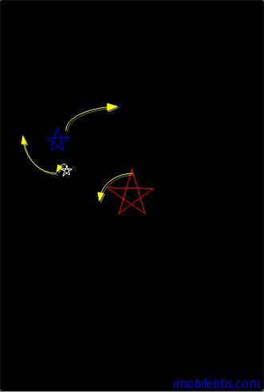
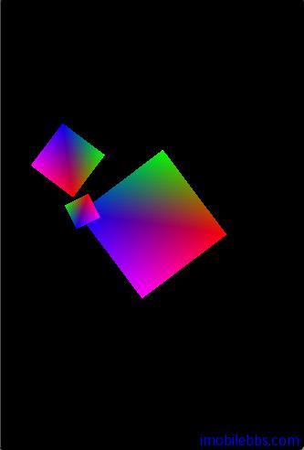

# 颜色 Color  
  
OpenGL ES 支持的颜色格式为 RGBA 模式（红，绿，蓝，透明度）。颜色的定义通常使用 Hex 格式0xFF00FF 或十进制格式(255,0,255)， 在 OpenGL 中却是使用0…1之间的浮点数表示。 0为0，1相当于255（0xFF)。

我们在 [Android OpenGL ES 开发教程(19)：绘制迷你太阳系](http://www.imobilebbs.com/wordpress/archives/2043) 绘制了红太阳，蓝地球，白月亮。使用的是 glColor4f 来指定颜色的. 这是使用的 Flat Coloring （单色）.



## Flat coloring（单色）

是通知 OpenGL 使用单一的颜色来渲染，OpenGL 将一直使用指定的颜色来渲染直到你指定其它的颜色。

指定颜色的方法为
  
```
public abstract void glColor4f(float red, float green, float blue, float alpha)。
```  

缺省的 red,green,blue 为1，代表白色。

## Smooth coloring （平滑颜色过渡）

当给每个顶点定义一个颜色时，OpenGL自动为不同顶点颜色之间生成中间过渡颜色（渐变色）。

可以参见 [Android OpenGL ES 简明开发教程五：添加颜色](http://www.imobilebbs.com/wordpress/archives/1545) 如何使用颜色，此外后面还可以使用光照(Lighting) 给物体添加颜色。  
  



 