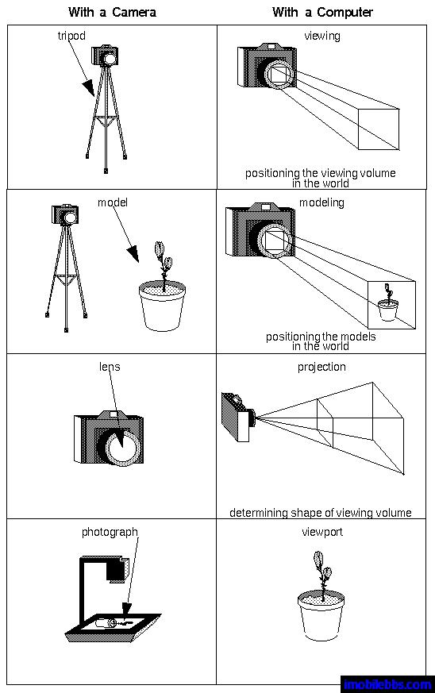

# 三维坐标系及坐标变换初步 
  
OpenGL ES 图形庫最终的结果是在二维平面上显示 3D 物体（常称作模型 Model)這是因為目前的打部分显示器还只能显示二维图形。但我们在构造 3D 模型时必須要有空间想象能力，所有对模型的描述还是使用三维坐标。也就是使用 3D 建模，而有 OpenGL ES 库来完成从 3D 模型到二维屏幕上的显示。

这个过程可以分成三个部分：

- 坐标变换，坐标变换通过使用变换矩阵来描述，因此学习 3D 绘图需要了解一些空间几何，矩阵运算的知识。三维坐标通常使用齐次坐标来定义。变换矩阵操作可以分为视角（Viewing），模型（Modeling）和投影（Projection）操作，這些操作可以有选择，平移，缩放，正侧投影，透视投影等。
- 由于最終的 3D 模型需要在一个矩形窗口中显示，因此在这个窗口之外的部分需要裁剪掉以提高绘图效率，对应3D 图形，裁剪是将处在剪切面之外的部分扔掉。
- 在最终绘制到显示器（2D 屏幕），需要建立起变换后的坐标和屏幕像素之间的对应关系，这通常称为「视窗」坐标变换(Viewport) transformation.  
 
如果我们使用照相机拍照的过程做类比，可以更好的理解 3D 坐标变换的过程。

 

1. 拍照时第一步是架起三角架並把相机的镜头指向需要拍摄的场景，对应到 3D 变换为 viewing transformation （平移或是选择 Camera ）
2. 然后摄影师可能需要调整被拍場景中某個物体的角度，位置，比如摄影师給架好三角架后給你拍照时，可以要让你调整站立姿势或是位置。對應到 3D 繪製就是 Modeling transformation （調整所繪模型的位置，角度或是縮放比例）。
3. 之后摄影师可以需要調整镜头取景（拉近或是拍攝遠景），相机取景框所能拍攝的場景會隨鏡頭的伸縮而變換，對應到 3D 繪图則為 Projection transformation(裁剪投影場景）。
4. 按下快門後，对于數碼相机可以直接在屏幕上显示當前拍攝的照片，一般可以充满整個屏幕（相当于将坐标做規範化處理 NDC），此時你可以使用縮放放大功能显示照片的部分。对应到 3D 绘图相当于 viewport transformation （可以對最終的图像縮放显示等）  

下图为 Android OpenGL ES 坐标变换的过程：

 

- Object Coordinate System: 也称作Local coordinate System，用來定义一個模型本身的坐標系。
- World Coordinate System: 3d 虚拟世界中的绝对坐标系，定义好這個坐标系的原点就可以用来描述模型的实现的位置，Camera 的位置，光源的位置。
- View Coordinate System: 一般使用用来计算光照效果。
- Clip Coordinate System:  对 3D 场景使用投影机换裁剪視角。
- Normalized device coordinate System (NDC): 规范后坐标系。
- Windows Coordinate System: 最后屏幕显示的 2D 坐标系統，一般原点定义在屏幕左上角。
  
 

对于 Viewing transformation (平移，选择相机）和 Modeling transformation（平移，选择模型）可以合并起來看，只是应为向左移动相机，和相机不同将模型右移的效果是等效的。

所以在 OpenGL ES 中，  

- 使用 GL10.GL_MODELVIEW 来同時指定 viewing matrix 和 modeling matrix.
- 使用 GL10.GL_PROJECTION 指定投影变换，OpenGL 支持透視投影和正侧投影（一般用于工程制图）。
- 使用 glViewport 指定 Viewport 变换。  

此时再看看下面的代码，就不是很难理解了，后面就逐步介绍各种坐标变换。
  
```
public void onSurfaceChanged(GL10 gl, int width, int height) {
// Sets the current view port to the new size.
gl.glViewport(0, 0, width, height);
// Select the projection matrix
gl.glMatrixMode(GL10.GL_PROJECTION);
// Reset the projection matrix
gl.glLoadIdentity();
// Calculate the aspect ratio of the window
GLU.gluPerspective(gl, 45.0f, (float) width / (float) height, 0.1f, 100.0f);
// Select the modelview matrix
 gl.glMatrixMode(GL10.GL_MODELVIEW);
// Reset the modelview matrix
 gl.glLoadIdentity();
}  
```