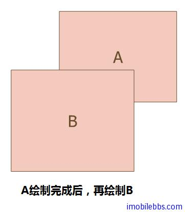

# Depth Buffer  
  
OpenGL ES 中 Depth Buffer 保存了像素与观测点之间的距离信息，在绘制3D图形时，将只绘制可见的面而不去绘制隐藏的面，这个过程叫”Hidden surface removal” ，采用的算法为”The depth buffer algorithm”。

一般来说，填充的物体的顺序和其顺序是一致的，而要准确的显示绘制物体在Z轴的前后关系，就需要先绘制距离观测点(ViewPoint)最远的物体，再绘制离观测点较远的物体，最后绘制离观测点最近的物体，因此需要对应所绘制物体进行排序。OpenGL ES 中使用 Depth Buffer 存放需绘制物体的相对距离。  
  

**The depth buffer algorithm** 在 OpenGL ES 3D 绘制的过程中这个算法是自动被采用的，但是了解这个算法有助于理解 OpenGL ES 部分 API 的使用。

这个算法的基本步骤如下：

1. 将 Depth Buffer 中的值使用最大值清空整个 Depth Buffer，这个最大值缺省为1.0 ，为距离 viewPoint 最远的裁剪的距离。最小值为 0，表示距离 viewPoint 最近的裁剪面的距离。距离大小为相对值而非实际距离，这个值越大表示与 Viewpoint 之间的距离越大。因此将初值这设为 1.0 相当于清空 Depth Buffer。
2. 当 OpenGL 栅格化所绘制基本图形(Primitive)，将计算该 Primitive 与 viewpoint 之间的距离，保存在 Depth Buffer 中。
3. 然后比较所要绘制的图形的距离和当前 Depth Buffer 中的值，如果这个距离比 Depth Buffer 中的值小，表示这个物体离 viewPoint 较近，Open GL 则更像相应的 Color Buffer 并使用这个距离更新 Depth Buffer，否则，表示当前要绘制的图形在已绘制的部分物体后面，则无需绘制该图形（删除）。  

这个过程也称为”Depth Test” (深度测试）。

下面给出了 OpenGL ES 中与 Depth Buffer 相关的几个方法：

- gl.Clear(GL10.GL_DEPTH_BUFFER_BIT) 清空 Depth Buffer (赋值为 1.0)通常清空 Depth Buffer 和 Color Buffer 同时进行。
- gl.glClearDepthf(float depth) 指定清空 Depth Buffer 是使用的值，缺省为 1.0，通常无需改变这个值，
- gl.glEnable(GL10.GL_DEPTH_TEST) 打开 depth Test
- gl.glDisable(GL10.GL_DEPTH_TEST) 关闭 depth Test