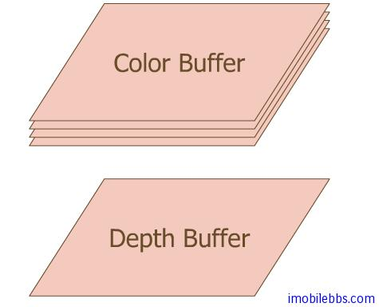

# FrameBuffer
  
OpenGL ES 中的 FrameBuffer 指的是存储像素的内存空间。对应一个二维图像，如果屏幕分辨率为1280X1024 ，如果屏幕支持 24 位真彩色 (RGB)，则存储这个屏幕区域的内存至少需要 1024X1280X3 个字节。此外如果需要支持透明度（Alpha），则一个像素需要 4 个字节。

对应 3D 图像来说，上面存储显示颜色的 Buffer 称为 Color Buffer，除 Color Buffer 之外，还需要存储每个像素和 View Point 之间的距离，OpenGL ES 中使用 Depth Buffer 存储像素与眼睛（eye 或是 view point) 的距离，Depth Buffer 也可称为 z Buffer.

此外 OpenGL ES 还定义了一个称为遮罩(Stencil) Buffer,可以将屏幕显示局限在某个由 Stencil Buffer 定义的区域，在日常生活中常见的 Stencil Buffer 示例时使用纸质模板在墙上或是 T 桖上印刷文字或是图像：

在 OpenGL ES 允许配置 Color Buffer 中 R,G,B,A 的颜色位数，Depth Buffer 的位数，以及 Stencil Buffer的位数：   

<table border="1" cellpadding="10">
<tbody>
<tr align="left" valign="top">
<th>参数</th>
<th>含义</th>
</tr>
<tr align="left" valign="top">
<td>GL_RED_BITS, GL_GREEN_BITS, 
GL_BLUE_BITS, GL_ALPHA_BITS</td>
<td>Number of bits per R, G, B, or A component in the color buffers</td>
</tr>
<tr align="left" valign="top">
<td>GL_DEPTH_BITS</td>
<td>Number of bits per pixel in the depth buffer</td>
</tr>
<tr align="left" valign="top">
<td>GL_STENCIL_BITS</td>
<td>Number of bits per pixel in the stencil buffer</td>
</tr>
</tbody>
</table>
        
在最终 OpenGL ES 写入这些 Buffer 时，OpenGL ES 提供一些 Mask 函数可以控制 Color Buffer 中 RGBA 通道，是否允许写入 Depth Buffer 等，这些 Mask 函数可以打开或是关闭某个通道，只有通道打开后，对应的分量才会写入指定 Buffer,比如你可以关闭红色通道，这样最后写道 Color Buffer 中就不含有红色。这些函数有 glColorMask, glDepthMask, glStencilMask。这些在后面有更详细的介绍。
  

