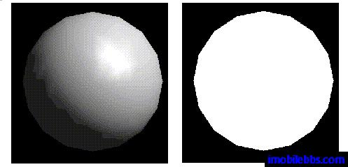
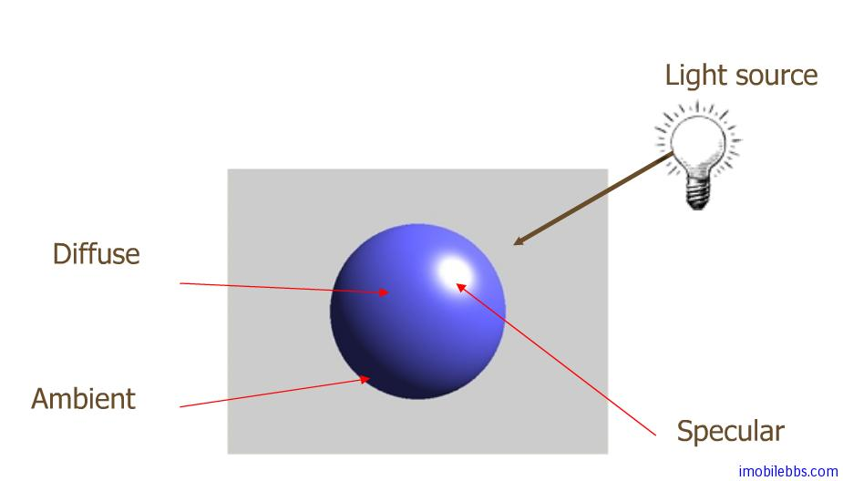

# OpenGL 光照模型   
  
前面绘制球体时 [Android OpenGL ES 开发教程(22)：绘制一个球体](http://www.imobilebbs.com/wordpress/archives/2271) ，为了能看出3D效果，给场景中添加光源。如果没有光照，绘出的球看上去和一个二维平面上圆没什么差别，如下图，左边为有光照效果的球体，右边为同一个球体但没有设置光源，看上去就没有立体效果，因此 OpenGL 光照效果对显示3D效果非常明显。  
  

在 OpenGL 光照模型中光源和光照效果可以细分为红，绿，蓝三个部分，光源由红，绿，蓝强度来定义，而物体表面材料由其反射红，绿，蓝的程度和方向来定义。OpenGL 光照模型使用的计算公式是对于现实世界光照的一个近似但效果非常好并适合快速计算。

OpenGL 光照模型中定义的光源可以分别控制，打开或关闭，OpenGL ES支持最多八个光源。

OpenGL 光照模型中最终的光照效果可以分为四个组成部分：Emitted(光源）, ambient(环境光）,diffuse(漫射光）和specular（镜面反射光），最终结果由这四种光叠加而成。  
  

Emitted ： 一般只发光物体或者光源，这种光不受其它光源的影响。

ambient: 指光线经过多次反射后已经无法得知其方向（可以看作来自所有方向），可以成为环境光，该光源如果射到某个平面，其反射方向为所有方向。**Ambient 不依赖于光源的方向**。

diffuse:当一束平行的入射光线射到粗糙的表面时，因面上凹凸不平，所以入射线虽然互相平行，由于各点的法线方向不一致，造成反射光线向不同的方向无规则地反射，这种反射称之为“漫反射”或“漫射”。这个反射的光则称为漫射光。漫射光射到某个平面时，其反射方向也为所有方向。**diffuse 只依赖于光源的方向和法线的方向**。

specular ： 一般指物体被光源直射的高亮区域，也可以成为镜面反射区，如金属。**specular 依赖于光源的方向，法线的方向和视角的方向**。

尽管光源可能只发送某一频率的光线，但 ambient，diffuse 和 specular 可能不同。比如使用白光照射一堵红墙，散射的光线可能为红色。OpenGL 允许为光源分别设置红，绿，蓝三个元素的值。

最终决定所看到物体的颜色除了光源的颜色和方向外，还取决于物体本身的颜色，比如红色的光照在红色的物体和蓝色的物体，最终看到的物体一个还是红色，一个为黑色。OpenGL 中对物体材料(Material)的颜色是通过其反射红，绿，蓝的比例来定义的。 和光源一样，物体的颜色也可以有不同的 ambient,diffuse 和 specular，表现为反射这些光的比例。ambient,diffuse 反射通常为同样的颜色，而 specular 常常表现为白色或灰色光，如使用白光照射一个红色的球，球的大部分区域显示为红色，而高亮区域为白色。