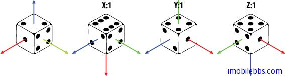
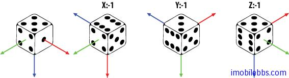

# 3D 坐标变换  

本篇介绍3D 坐标系下的坐标变换 transformations。

## Coordinate System坐标系

OpenGL 使用了右手坐标系统，右手坐标系判断方法：在空间直角坐标系中，让右手拇指指向x轴的正方向，食指指向y轴的正方向，如果中指能指向z轴的正方向，则称这个坐标系为右手直角坐标系。  
  


## Translate平移变换

方法 public abstract void glTranslatef (float x, float y, float z) 用于坐标平移变换。

在上个例子中我们把需要显示的正方形后移了4个单位，就是使用的坐标的平移变换，可以进行多次平移变换，其结果为多个平移矩阵的累计结果，矩阵的顺序不重要，可以互换。
  


## Rotate旋转

方法 public abstract void glRotatef(float angle, float x, float y, float z)用来实现选择坐标变换，单位为角度。(x,y,z)定义旋转的参照矢量方向。多次旋转的顺序非常重要。
  
  

比如你选择一个骰子，首先按下列顺序选择3次：

```
gl.glRotatef(90f, 1.0f, 0.0f, 0.0f);
gl.glRotatef(90f, 0.0f, 1.0f, 0.0f);
gl.glRotatef(90f, 0.0f, 0.0f, 1.0f);  
```  
  
  

然后打算逆向旋转回原先的初始状态，需要有如下旋转：

```
gl.glRotatef(90f, -1.0f, 0.0f, 0.0f);
gl.glRotatef(90f, 0.0f, -1.0f, 0.0f);
gl.glRotatef(90f, 0.0f, 0.0f, -1.0f);  
```  
  
  

或者如下旋转：

```
gl.glRotatef(90f, 0.0f, 0.0f, -1.0f);
gl.glRotatef(90f, 0.0f, -1.0f, 0.0f);
gl.glRotatef(90f, -1.0f, 0.0f, 0.0f);  
```  

旋转变换 glRotatef(angle, -x, -y, -z) 和 glRotatef(-angle, x, y, z)是等价的，但选择变换的顺序直接影响最终坐标变换的结果。 角度为正时表示逆时针方向。

## Translate & Rotate （平移和旋转组合变换）

在对 Mesh（网格，构成三维形体的基本单位）同时进行平移和选择变换时，坐标变换的顺序也直接影响最终的结果。

比如：先平移后旋转，旋转的中心为平移后的坐标。  
  


先选择后平移： 平移在则相对于旋转后的坐标系：  
  


一个基本原则是，坐标变换都是相对于变换的 Mesh 本身的坐标系而进行的。

## Scale（缩放）

方法 public abstract void glScalef (float x, float y, float z)用于缩放变换。

下图为使用 gl.glScalef(2f, 2f, 2f) 变换后的基本，相当于把每个坐标值都乘以2.  
  
 

## Translate & Scale（平移和缩放组合变换）

同样当需要平移和缩放时，变换的顺序也会影响最终结果。

比如先平移后缩放：

```
gl.glTranslatef(2, 0, 0);
gl.glScalef(0.5f, 0.5f, 0.5f);  
```  
  
  

如果调换一下顺序：
  
```
gl.glScalef(0.5f, 0.5f, 0.5f);
gl.glTranslatef(2, 0, 0);  
```  

结果就有所不同：  
  


## 矩阵操作，单位矩阵

在进行平移，旋转，缩放变换时，所有的变换都是针对当前的矩阵（与当前矩阵相乘），如果需要将当前矩阵回复最初的无变换的矩阵，可以使用单位矩阵（无平移，缩放，旋转）。
  
```
public abstract void glLoadIdentity()。
```  

在栈中保存当前矩阵和从栈中恢复所存矩阵，可以使用
  
```  
public abstract void glPushMatrix()
```  

和
  
```
public abstract void glPopMatrix()。
```  

在进行坐标变换的一个好习惯是在变换前使用 glPushMatrix 保存当前矩阵，完成坐标变换操作后，再调用 glPopMatrix 恢复原先的矩阵设置。

最后利用上面介绍的坐标变换知识，来绘制3个正方形A,B,C。进行缩放变换，使的B比A小50%，C比B小50%。 然后以屏幕中心逆时针旋转A，B以A为中心顺时针旋转，C以B为中心顺时针旋转同时以自己中心高速逆时针旋转。

修改 onDrawFrame 代码如下：

```
public void onDrawFrame(GL10 gl) {
 // Clears the screen and depth buffer.
 gl.glClear(GL10.GL_COLOR_BUFFER_BIT
 | GL10.GL_DEPTH_BUFFER_BIT);
 // Replace the current matrix with the identity matrix
 gl.glLoadIdentity();
 // Translates 10 units into the screen.
 gl.glTranslatef(0, 0, -10);
 // SQUARE A
 // Save the current matrix.
 gl.glPushMatrix();
 // Rotate square A counter-clockwise.
 gl.glRotatef(angle, 0, 0, 1);
 // Draw square A.
 square.draw(gl);
 // Restore the last matrix.
 gl.glPopMatrix();
 // SQUARE B
 // Save the current matrix
 gl.glPushMatrix();
 // Rotate square B before moving it,
 //making it rotate around A.
 gl.glRotatef(-angle, 0, 0, 1);
 // Move square B.
 gl.glTranslatef(2, 0, 0);
 // Scale it to 50% of square A
 gl.glScalef(.5f, .5f, .5f);
 // Draw square B.
 square.draw(gl);
 // SQUARE C
 // Save the current matrix
 gl.glPushMatrix();
 // Make the rotation around B
 gl.glRotatef(-angle, 0, 0, 1);
 gl.glTranslatef(2, 0, 0);
 // Scale it to 50% of square B
 gl.glScalef(.5f, .5f, .5f);
 // Rotate around it's own center.
 gl.glRotatef(angle*10, 0, 0, 1);
 // Draw square C.
 square.draw(gl);
 // Restore to the matrix as it was before C.
 gl.glPopMatrix();
 // Restore to the matrix as it was before B.
 gl.glPopMatrix();
 // Increse the angle.
 angle++;
 }  
```  
  
  
  
本例代码[下载](http://www.imobilebbs.com/download/android/opengles/OpenGLESTutorial2.zip)

