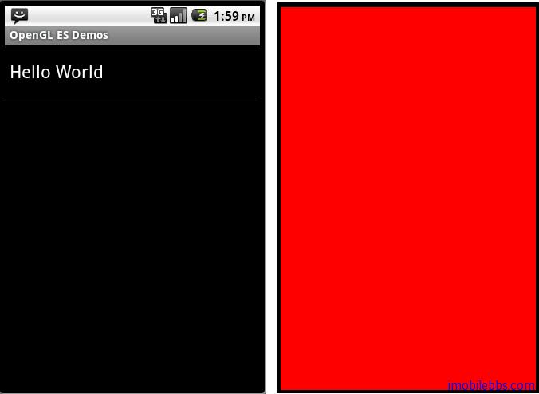

# 创建实例应用OpenGLDemos程序框架 
  
有了前面关于 Android OpenGL ES 的介绍，可以开始创建示例程序 OpenGLDemos。

使用 Eclipse 创建一个 Android 项目

* Project Name: OpenGLDemos
* Build Target: Android 1.6 ( >1.5 即可）
* Application Name: Android OpenGL ES Demos
* Package Name: com.pstreets.opengl.demo
* Create Activity:AndroidOpenGLDemo  

采用 Android ApiDemos 类似的方法，AndroidOpenGLDemo 为一 ListActivity ,可以使用PackageManager 读取所有 Category 为guidebee.intent.category.opengl.SAMPLE_CODE 的Activity。 [Android ApiDemos 示例解析(2): SimpleAdapter,ListActivity,PackageManager](http://www.imobilebbs.com/wordpress/archives/1045)

创建一个OpenGLRenderer 实现 GLSurfaceView.Renderer 接口：

```
public class OpenGLRenderer implements Renderer {
 private final IOpenGLDemo openGLDemo;
 public OpenGLRenderer(IOpenGLDemo demo){
 openGLDemo=demo;
 }
 public void onSurfaceCreated(GL10 gl, EGLConfig config) {
 // Set the background color to black ( rgba ).
 gl.glClearColor(0.0f, 0.0f, 0.0f, 0.5f);
 // Enable Smooth Shading, default not really needed.
 gl.glShadeModel(GL10.GL_SMOOTH);
 // Depth buffer setup.
 gl.glClearDepthf(1.0f);
 // Enables depth testing.
 gl.glEnable(GL10.GL_DEPTH_TEST);
 // The type of depth testing to do.
 gl.glDepthFunc(GL10.GL_LEQUAL);
 // Really nice perspective calculations.
 gl.glHint(GL10.GL_PERSPECTIVE_CORRECTION_HINT,
 GL10.GL_NICEST);
 }
 public void onDrawFrame(GL10 gl) {
 if(openGLDemo!=null){
 openGLDemo.DrawScene(gl);
 }
 }
 public void onSurfaceChanged(GL10 gl, int width, int height) {
 // Sets the current view port to the new size.
 gl.glViewport(0, 0, width, height);
 // Select the projection matrix
 gl.glMatrixMode(GL10.GL_PROJECTION);
 // Reset the projection matrix
 gl.glLoadIdentity();
 // Calculate the aspect ratio of the window
 GLU.gluPerspective(gl, 45.0f,
 (float) width / (float) height,
 0.1f, 100.0f);
 // Select the modelview matrix
 gl.glMatrixMode(GL10.GL_MODELVIEW);
 // Reset the modelview matrix
 gl.glLoadIdentity();
 }
}  
```  

为简洁起见，为所有的示例定义了一个接口 IOpenGLDemo，

```
public interface IOpenGLDemo {
 public void DrawScene(GL10 gl);
}  
```  

DrawScene 用于实际的 GL 绘图示例代码，其它的初始化工作基本就由 GLSurfaceView 和OpenGLRenderer 完成,其中 onSurfaceCreated 和 onSurfaceChanged 中的代码含义现在无需了解，后面会有具体介绍，只要知道它们是用来初始化 GLSurfaceView 就可以了。

最后使用一个简单的例子 “Hello World” 结束本篇，“Hello World” 使用红色背景刷新屏幕。

```
public class HelloWorld extends Activity
   implements IOpenGLDemo{
    /** Called when the activity is first created. */
    @Override
    public void onCreate(Bundle savedInstanceState) 
        super.onCreate(savedInstanceState);
        this.requestWindowFeature(Window.FEATURE_NO_TITLE);
        getWindow()
         .setFlags(WindowManager.LayoutParams.FLAG_FULLSCREEN,
            WindowManager.LayoutParams.FLAG_FULLSCREEN);
        mGLSurfaceView = new GLSurfaceView(this);
        mGLSurfaceView.setRenderer(new OpenGLRenderer(this));
        setContentView(mGLSurfaceView);
    }
    public void DrawScene(GL10 gl) {
        gl.glClearColor(1.0f, 0.0f, 0.0f, 0.0f);
        // Clears the screen and depth buffer.
        gl.glClear(GL10.GL_COLOR_BUFFER_BIT
          | GL10.GL_DEPTH_BUFFER_BIT);
    }
    @Override
    protected void onResume() {
        // Ideally a game should implement
        // onResume() and onPause()
        // to take appropriate action when the
        //activity looses focus
        super.onResume();
        mGLSurfaceView.onResume();
    }
    @Override
    protected void onPause() {
        // Ideally a game should implement onResume()
        //and onPause()
        // to take appropriate action when the
        //activity looses focus
        super.onPause();
        mGLSurfaceView.onPause();
    }
    private GLSurfaceView mGLSurfaceView;
}  
```  

其对应在 AndroidManifest.xml 中的定义如下：

<activity android:name=”.HelloWorld” android:label=”@string/activity_helloworld”>
<intent-filter>
<action android:name=”android.intent.action.MAIN” />
<category android:name=”guidebee.intent.category.opengl.SAMPLE_CODE” />
</intent-filter>
</activity>  
  


本例[下载](http://www.imobilebbs.com/wordpress/archives/www.imobilebbs.com/download/android/opengles/Helloworld.zip)