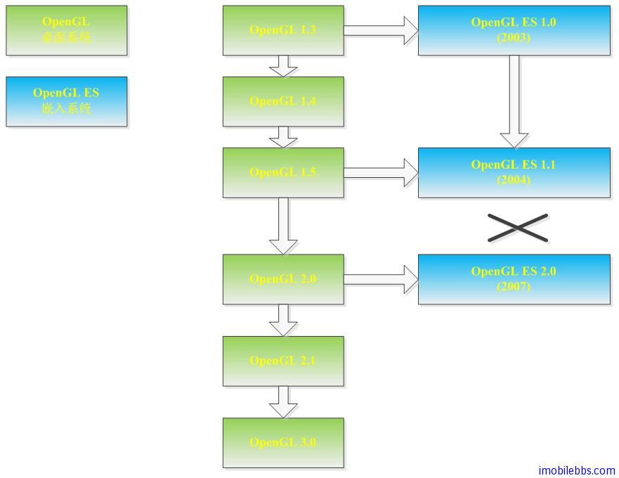

# 关于OpenGL ES  
  
## 什么是OpenGL ES?
* OpenGL ES (为 OpenGL for Embedded System 的缩写） 为适用于嵌入式系统的一个免费二维和三维图形库。  
* 为桌面版本 OpenGL 的一个子集。  
* OpenGL ES 定义了一个在移动平台上能够支持 OpenGL 最基本功能的精简标准，以适应如手机，PDA 或其它消费者移动终端的显示系统。  
* Khronos Group 定义和管理了 OpenGL ES标准。  

## OpenGL 与 OpenGL ES 的关系  

OpenGL ES 是基于桌面版本 OpenGL 的，下图显示了 OpenGL 和 OpenGL ES之间的关系图

* OpenGL ES 1.0  基于 OpenGL 1.3 ， 在2003年发布
* OpenGL ES 1.1   基于OpenGL 1.5 ,  在2004年发布
* OpenGL ES 2.0  基于OpenGL2.0,   在2007年发布
* OpenGL 2.0 向下兼容OpenGL 1.5   而 OpenGL ES 2.0 和OpenGL ES 1.x 不兼容，是两种完全不同的实现。  

## OpenGL ES Profiles  

OpenGL ES 1.x 支持两种 Profile 以支持不同类型的嵌入设备。

1. The Common Profile 针对支持硬件浮点运算的设备，API 支持定点和浮点运算。
2. The Common Lite Profile 针对不支持硬件浮点运算的设备，API 只支持定点运算。             

本教程主要针对 Common Profile 设备支持浮点运算。