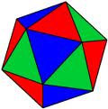
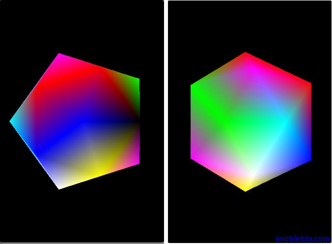

# 绘制一个20面体  
  
前面介绍了 OpenGL ES 所有能够绘制的基本图形，点，线段和三角形。其它所有复杂的2D或3D图形都是由这些基本图形构成。

本例介绍如何使用三角形构造一个正20面体。一个正20面体，有12个顶点，20个面，30条边构成：  
    


创建一个 DrawIcosahedron Activity，定义20面体的12个顶点，和20个面如下：
  
```
static final float X=.525731112119133606f;
static final float Z=.850650808352039932f;
static float vertices[] = new float[]{
 -X, 0.0f, Z, X, 0.0f, Z, -X, 0.0f, -Z, X, 0.0f, -Z,
 0.0f, Z, X, 0.0f, Z, -X, 0.0f, -Z, X, 0.0f, -Z, -X,
 Z, X, 0.0f, -Z, X, 0.0f, Z, -X, 0.0f, -Z, -X, 0.0f
 };
static short indices[] = new short[]{
 0,4,1, 0,9,4, 9,5,4, 4,5,8, 4,8,1,
 8,10,1, 8,3,10, 5,3,8, 5,2,3, 2,7,3,
 7,10,3, 7,6,10, 7,11,6, 11,0,6, 0,1,6,
 6,1,10, 9,0,11, 9,11,2, 9,2,5, 7,2,11 };  
```  

OpenGL ES 缺省使用同一种颜色来绘制图形，为了能够更好的显示3D效果，我们为每个顶点随机定义一些颜色如下：
  
```
float[] colors = {
 0f, 0f, 0f, 1f,
 0f, 0f, 1f, 1f,
 0f, 1f, 0f, 1f,
 0f, 1f, 1f, 1f,
 1f, 0f, 0f, 1f,
 1f, 0f, 1f, 1f,
 1f, 1f, 0f, 1f,
 1f, 1f, 1f, 1f,
 1f, 0f, 0f, 1f,
 0f, 1f, 0f, 1f,
 0f, 0f, 1f, 1f,
 1f, 0f, 1f, 1f
};  
```  

添加颜色可以参见 Android OpenGL ES 简明开发教程五：添加颜色 以后也会有详细说明。

将顶点，面，颜色存放到 Buffer 中以提高性能：
  
```
private FloatBuffer vertexBuffer;
private FloatBuffer colorBuffer;
private ShortBuffer indexBuffer;
ByteBuffer vbb
= ByteBuffer.allocateDirect(vertices.length * 4);
vbb.order(ByteOrder.nativeOrder());
vertexBuffer = vbb.asFloatBuffer();
vertexBuffer.put(vertices);
vertexBuffer.position(0);
ByteBuffer cbb
= ByteBuffer.allocateDirect(colors.length * 4);
cbb.order(ByteOrder.nativeOrder());
colorBuffer = cbb.asFloatBuffer();
colorBuffer.put(colors);
colorBuffer.position(0);
ByteBuffer ibb
= ByteBuffer.allocateDirect(indices.length * 2);
ibb.order(ByteOrder.nativeOrder());
indexBuffer = ibb.asShortBuffer();
indexBuffer.put(indices);
indexBuffer.position(0);  
```  

看一看DrawScene代码：
  
```
public void DrawScene(GL10 gl) {
 super.DrawScene(gl);
 gl.glColor4f(1.0f, 0.0f, 0.0f, 1.0f);
 gl.glLoadIdentity();
 gl.glTranslatef(0, 0, -4);
 gl.glRotatef(angle, 0, 1, 0);
 gl.glFrontFace(GL10.GL_CCW);
 gl.glEnable(GL10.GL_CULL_FACE);
 gl.glCullFace(GL10.GL_BACK);
 gl.glEnableClientState(GL10.GL_VERTEX_ARRAY);
 gl.glVertexPointer(3, GL10.GL_FLOAT, 0, vertexBuffer);
 gl.glEnableClientState(GL10.GL_COLOR_ARRAY);
 gl.glColorPointer(4, GL10.GL_FLOAT, 0, colorBuffer);
 gl.glDrawElements(GL10.GL_TRIANGLES, indices.length,
 GL10.GL_UNSIGNED_SHORT, indexBuffer);
 gl.glDisableClientState(GL10.GL_VERTEX_ARRAY);
 gl.glDisable(GL10.GL_CULL_FACE);
 angle++;
}  
```  

用来绘制20面体使用了 gl.glDrawElements：

public abstract void glDrawElements(int mode, int count, int type, Buffer indices) ，可以重新定义顶点的顺序，顶点的顺序由 indices Buffer 指定。

本例会显示一个绕Y轴不断旋转的20面体，如何旋转模型将在后面的坐标系统和坐标变换中介绍.

   
  
DrawLine, DrawTriangle,及本例[下载](http://www.imobilebbs.com/download/android/opengles/drawprimitives.zip)