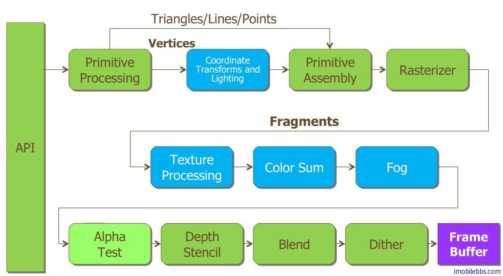

# OpenGL ES管道(Pipeline)  
  
大部分图形系统都可以比作工厂中的装配线(Assemble line)或者称为管道(Pipeline)。前一道的输出作为下道工序的输入。主 CPU 发出一个绘图指令，然后可能由硬件部件完成坐标变换，裁剪，添加颜色或是材质，最后在屏幕上显示出来。

OpenGL ES 1.x 的工序是固定的，称为 Fix-Function Pipeline,可以想象一个带有很多控制开关的机器，尽管加工的工序是固定的，但是可以通过打开或关闭开关来设置参数或者打开关闭某些功能。

OpenGL ES 2.0 允许提供编程来控制一些重要的工序，一些“繁琐”的工序比如栅格化等仍然是固定的。

下图显示了 OpenGL ES 1.x 固定管道的结构图：

* 管道“工序”大致可以分为 Transformation Stage 和 Rasterization Stage两大步。
* OpenGL ES 支持的基本图形为 点Point, 线Line, 和三角形Triangle ，其它所有复制图形都是通过这几种基本几何图形组合而成。
* 在发出绘图指令后，会对顶点(Vertices)数组进行指定的坐标变换或光照处理。
* 顶点处理完成后，通过Rasterizer 来生成像素信息，称为”Fragments“ 。
* 对于Fragment 在经过Texture Processing, Color Sum ,Fog 等处理并将最终处理结果存放在内存中（称为FrameBuffer)。
* OpenGL 2.0可以通过编程来修改蓝色的步骤，称为Programmable Shader.    

以上管道中工序可以通过设置来打开或关闭某些功能（比如无需雾化 Fog 处理），并可以为某个工序设置参数，比如设置 Vertext Array。

本教程主要介绍 OpenGL ES 1.1 编程，支持 OpenGL ES 2.0 的设备一般会同时支持 OpenGL ES 1.1。