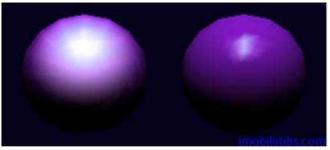
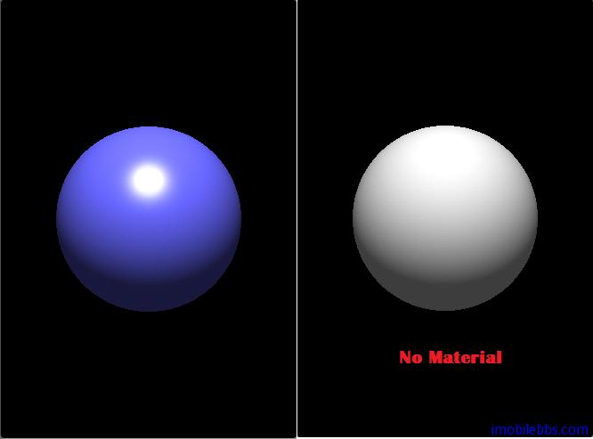

# 材质及光照示例  
  
设置物体表面材料(Material)的反光属性（颜色和材质）的方法如下：
  
```
public void glMaterialf(int face,int pname,float param)
public void glMaterialfv(int face,int pname,float[] params,int offset)
public void glMaterialfv(int face,int pname,FloatBuffer params)
```  

* face : 在OpenGL ES中只能使用GL_FRONT_AND_BACK，表示修改物体的前面和后面的材质光线属性。
* pname: 参数类型，可以有GL_AMBIENT, GL_DIFFUSE, GL_SPECULAR, GL_EMISSION, GL_SHININESS。这些参数用在光照方程。
* param：参数的值。  

其中 GL\_AMBIENT,GL\_DIFFUSE,GL\_SPECULAR ，GL\_EMISSION 为颜色 RGBA 值，GL\_SHININESS 值可以从0到128，值越大，光的散射越小：  
  
 

此外，方法 glLightModleXX 给出了光照模型的参数
  
```
public void glLightModelf(int pname,float param)
public void glLightModelfv(int pname,float[] params,int offset)
public void glLightModelfv(int pname,FloatBuffer params)
```  

* pname: 参数类型，可以为GL_LIGHT_MODEL_AMBIENT和GL_LIGHT_MODEL_TWO_SIDE
* params: 参数的值。  

最终顶点的颜色由这些参数（光源，材质光学属性，光照模型）综合决定（光照方程计算出）。

下面例子在场景中设置一个白色光源：
  
```
public void initScene(GL10 gl){
 float[] amb = { 1.0f, 1.0f, 1.0f, 1.0f, };
 float[] diff = { 1.0f, 1.0f, 1.0f, 1.0f, };
 float[] spec = { 1.0f, 1.0f, 1.0f, 1.0f, };
 float[] pos = { 0.0f, 5.0f, 5.0f, 1.0f, };
 float[] spot_dir = { 0.0f, -1.0f, 0.0f, };
 gl.glEnable(GL10.GL\_DEPTH\_TEST);
 gl.glEnable(GL10.GL\_CULL\_FACE);
 gl.glEnable(GL10.GL\_LIGHTING);
 gl.glEnable(GL10.GL\_LIGHT0);
 ByteBuffer abb
 = ByteBuffer.allocateDirect(amb.length\*4);
 abb.order(ByteOrder.nativeOrder());
 FloatBuffer ambBuf = abb.asFloatBuffer();
 ambBuf.put(amb);
 ambBuf.position(0);
 ByteBuffer dbb
 = ByteBuffer.allocateDirect(diff.length\*4);
 dbb.order(ByteOrder.nativeOrder());
 FloatBuffer diffBuf = dbb.asFloatBuffer();
 diffBuf.put(diff);
 diffBuf.position(0);
 ByteBuffer sbb
 = ByteBuffer.allocateDirect(spec.length\*4);
 sbb.order(ByteOrder.nativeOrder());
 FloatBuffer specBuf = sbb.asFloatBuffer();
 specBuf.put(spec);
 specBuf.position(0);
 ByteBuffer pbb
 = ByteBuffer.allocateDirect(pos.length\*4);
 pbb.order(ByteOrder.nativeOrder());
 FloatBuffer posBuf = pbb.asFloatBuffer();
 posBuf.put(pos);
 posBuf.position(0);
 ByteBuffer spbb
 = ByteBuffer.allocateDirect(spot_dir.length\*4);
 spbb.order(ByteOrder.nativeOrder());
 FloatBuffer spot_dirBuf = spbb.asFloatBuffer();
 spot_dirBuf.put(spot_dir);
 spot_dirBuf.position(0);
 gl.glLightfv(GL10.GL\_LIGHT0, GL10.GL\_AMBIENT, ambBuf);
 gl.glLightfv(GL10.GL\_LIGHT0, GL10.GL\_DIFFUSE, diffBuf);
 gl.glLightfv(GL10.GL\_LIGHT0, GL10.GL\_SPECULAR, specBuf);
 gl.glLightfv(GL10.GL\_LIGHT0, GL10.GL\_POSITION, posBuf);
 gl.glLightfv(GL10.GL\_LIGHT0, GL10.GL\_SPOT\_DIRECTION,
 spot_dirBuf);
 gl.glLightf(GL10.GL\_LIGHT0, GL10.GL\_SPOT_EXPONENT, 0.0f);
 gl.glLightf(GL10.GL\_LIGHT0, GL10.GL\_SPOT\_CUTOFF, 45.0f);
 gl.glLoadIdentity();
 GLU.gluLookAt(gl,0.0f, 4.0f, 4.0f, 0.0f, 0.0f, 0.0f,
 0.0f, 1.0f, 0.0f);
}  
```  

绘制一个球，并使用蓝色材质：
  
```
public void drawScene(GL10 gl) {
 super.drawScene(gl);
 float[] mat_amb = {0.2f \* 0.4f, 0.2f \* 0.4f,
 0.2f \* 1.0f, 1.0f,};
 float[] mat\_diff = {0.4f, 0.4f, 1.0f, 1.0f,};
 float[] mat\_spec = {1.0f, 1.0f, 1.0f, 1.0f,};
 ByteBuffer mabb
 = ByteBuffer.allocateDirect(mat\_amb.length*4);
 mabb.order(ByteOrder.nativeOrder());
 FloatBuffer mat\_ambBuf = mabb.asFloatBuffer();
 mat\_ambBuf.put(mat\_amb);
 mat\_ambBuf.position(0);
 ByteBuffer mdbb
 = ByteBuffer.allocateDirect(mat\_diff.length\*4);
 mdbb.order(ByteOrder.nativeOrder());
 FloatBuffer mat\_diffBuf = mdbb.asFloatBuffer();
 mat\_diffBuf.put(mat\_diff);
 mat\_diffBuf.position(0);
 ByteBuffer msbb
 = ByteBuffer.allocateDirect(mat\_spec.length\*4);
 msbb.order(ByteOrder.nativeOrder());
 FloatBuffer mat\_specBuf = msbb.asFloatBuffer();
 mat\_specBuf.put(mat\_spec);
 mat\_specBuf.position(0);
 gl.glMaterialfv(GL10.GL\_FRONT\_AND\_BACK,
 GL10.GL\_AMBIENT, mat\_ambBuf);
 gl.glMaterialfv(GL10.GL\_FRONT\_AND\_BACK,
 GL10.GL\_DIFFUSE, mat\_diffBuf);
 gl.glMaterialfv(GL10.GL\_FRONT\_AND\_BACK,
 GL10.GL\_SPECULAR, mat\_specBuf);
 gl.glMaterialf(GL10.GL\_FRONT\_AND\_BACK,
 GL10.GL\_SHININESS, 64.0f);
 sphere.draw(gl);
}  
```  
 

本例[下载](http://www.imobilebbs.com/download/android/opengles/lighting.zip)