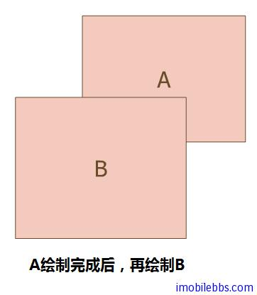

# Depth Buffer  
  
OpenGL ES 中 Depth Buffer 保存了像素与观测点之间的距离信息，在绘制3D图形时，将只绘制可见的面而不去绘制隐藏的面，这个过程叫”Hidden surface removal” ，采用的算法为”The depth buffer algorithm”。

一般来说，填充的物体的顺序和其顺序是一致的，而要准确的显示绘制物体在Z轴的前后关系，就需要先绘制距离观测点(ViewPoint)最远的物体，再绘制离观测点较远的物体，最后绘制离观测点最近的物体，因此需要对应所绘制物体进行排序。OpenGL ES 中使用 Depth Buffer 存放需绘制物体的相对距离。  
  

**The depth buffer algorithm** 在 OpenGL ES 3D 绘制的过程中这个算法是自动被采用的，但是了解这个算法有助于理解 OpenGL ES 部分 API 的使用。

这个算法的基本步骤如下：

1. 将 Depth Buffer 中的值使用最大值清空整个 Depth Buffer，这个最大值缺省为1.0 ，为距离 viewPoint 最远的裁剪的距离。最小值为0，表示距离 viewPoint 最近的裁剪面的距离。距离大小为相对值而非实际距离，这个值越大表示与 Viewpoint 之间的距离越大。因此将初值这设为1.0 相当于清空 Depth Buffer。
2. 当 OpenGL 栅格化所绘制基本图形(Primitive)，将计算该 Primitive 与 viewpoint 之间的距离，保存在 Depth Buffer 中。
3. 然后比较所要绘制的图形的距离和当前 Depth Buffer 中的值，如果这个距离比 Depth Buffer 中的值小，表示这个物体离viewPoint 较近，Open GL 则更像相应的 Color Buffer 并使用这个距离更新 Depth Buffer,否则，表示当前要绘制的图形在已绘制的部分物体后面，则无需绘制该图形（删除）。  

这个过程也称为”Depth Test” (深度测试）。

下面给出了OpenGL ES中与Depth Buffer相关的几个方法：

* gl.Clear(GL10.GL_DEPTH_BUFFER_BIT) 清空Depth Buffer (赋值为1.0)通常清空Depth Buffer和Color Buffer同时进行。
* gl.glClearDepthf(float depth) 指定清空Depth Buffer是使用的值，缺省为1.0，通常无需改变这个值，
* gl.glEnable(GL10.GL_DEPTH_TEST) 打开depth Test
* gl.glDisable(GL10.GL_DEPTH_TEST) 关闭depth Test