# 3D绘图基本概念  

前面介绍了使用 Android 编写 OpenGL ES 应用的程序框架，本篇介绍3D绘图的一些基本构成要素，最终将实现一个多边形的绘制。

一个3D图形通常是由一些小的基本元素（顶点，边，面，多边形）构成，每个基本元素都可以单独来操作。

## Vertex （顶点）

顶点是3D建模时用到的最小构成元素，顶点定义为两条或是多条边交会的地方。在3D模型中一个顶点可以为多条边，面或是多边形所共享。一个顶点也可以代表一个点光源或是 Camera 的位置。下图中标识为黄色的点为一个顶点(Vertex)。  
  


在 Android 系统中可以使用一个浮点数数组来定义一个顶点，浮点数数组通常放在一个 Buffer（java.nio)中来提高性能。

比如：下图中定义了四个顶点和对应的 Android 顶点定义：

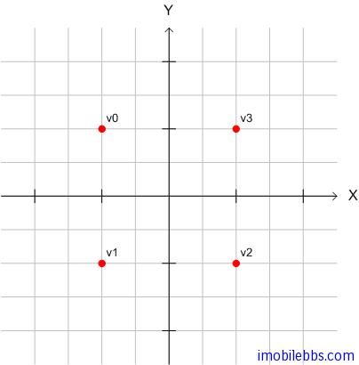

```
private float vertices[] = {
 -1.0f,  1.0f, 0.0f,  // 0, Top Left
 -1.0f, -1.0f, 0.0f,  // 1, Bottom Left
 1.0f, -1.0f, 0.0f,  // 2, Bottom Right
 1.0f,  1.0f, 0.0f,  // 3, Top Right
};  
```  

为了提高性能，通常将这些数组存放到 java.io 中定义的 Buffer 类中：

```
// a float is 4 bytes, therefore we multiply the
//number if vertices with 4.
ByteBuffer vbb = ByteBuffer.allocateDirect(vertices.length * 4);
vbb.order(ByteOrder.nativeOrder());
FloatBuffer vertexBuffer = vbb.asFloatBuffer();
vertexBuffer.put(vertices);
vertexBuffer.position(0);  
```  

有了顶点的定义，下面一步就是如何将它们传给 OpenGL ES 库，OpenGL ES 提供一个成为”管道 Pipeline ”的机制，这个管道定义了一些“开关”来控制 OpenGL ES 支持的某些功能，缺省情况这些功能是关闭的，如果需要使用 OpenGL ES 的这些功能，需要明确告知 OpenGL “管道”打开所需功能。因此对于我们的这个示例，需要告诉 OpenGL 库打开 Vertex buffer 以便传入顶点坐标 Buffer。要注意的使用完某个功能之后，要关闭这个功能以免影响后续操作：

```
// Enabled the vertex buffer for writing and to be used during rendering.
gl.glEnableClientState(GL10.GL_VERTEX_ARRAY);// OpenGL docs.
// Specifies the location and data format of an array of vertex
// coordinates to use when rendering.
gl.glVertexPointer(3, GL10.GL_FLOAT, 0, vertexBuffer); // OpenGL docs.
When you are done with the buffer don't forget to disable it.
// Disable the vertices buffer.
gl.glDisableClientState(GL10.GL_VERTEX_ARRAY);// OpenGL docs.  
```  

## Edge（边）

边定义为两个顶点之间的线段。边是面和多边形的边界线。在3D模型中，边可以被相邻的两个面或是多边形形共享。对一个边做变换将影响边相接的所有顶点，面或多边形。在 OpenGL 中，通常无需直接来定义一个边，而是通过顶点定义一个面，从而由面定义了其所对应的三条边。可以通过修改边的两个顶点来更改一条边，下图黄色的线段代表一条边：

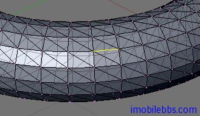

## Face (面）

在 OpenGL ES 中，面特指一个三角形，由三个顶点和三条边构成，对一个面所做的变化影响到连接面的所有顶点和边，面多边形。下图黄色区域代表一个面。  
  
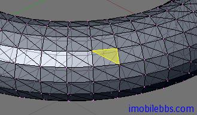

**定义面的顶点的顺序很重要** 在拼接曲面的时候，用来定义面的顶点的顺序非常重要，因为顶点的顺序定义了面的朝向（前向或是后向），为了获取绘制的高性能，一般情况不会绘制面的前面和后面，只绘制面的“前面”。虽然“前面”“后面”的定义可以应人而易，但一般为所有的“前面”定义统一的顶点顺序(顺时针或是逆时针方向）。

下面代码设置逆时针方法为面的“前面”：
  
```
gl.glFrontFace(GL10.GL_CCW);  
```  

打开 忽略“后面”设置：

```
gl.glEnable(GL10.GL_CULL_FACE);  
```  

明确指明“忽略“哪个面的代码如下：

```
gl.glCullFace(GL10.GL_BACK);  
```  

## Polygon （多边形）

多边形由多个面（三角形）拼接而成，在三维空间上，多边形并一定表示这个 Polygon 在同一平面上。这里我们使用缺省的逆时针方向代表面的“前面 Front)，下图黄色区域为一个多边形。
  
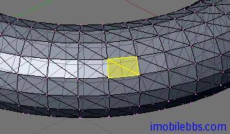  

来看一个多边形的示例在 Android 系统如何使用顶点和 buffer 来定义，如下图定义了一个正方形：
  
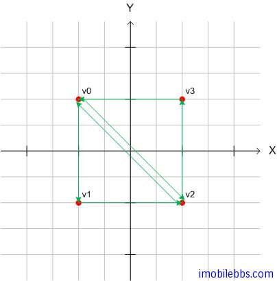

对应的顶点和buffer 定义代码：

```
private short[] indices = { 0, 1, 2, 0, 2, 3 };
To gain some performance we also put this ones in a byte buffer.
// short is 2 bytes, therefore we multiply the number if vertices with 2.
ByteBuffer ibb = ByteBuffer.allocateDirect(indices.length * 2);
ibb.order(ByteOrder.nativeOrder());
ShortBuffer indexBuffer = ibb.asShortBuffer();
indexBuffer.put(indices);
indexBuffer.position(0);  
```  

## Render (渲染）

我们已定义好了多边形，下面就要了解如和使用 OpenGL ES 的 API 来绘制（渲染）这个多边形了。OpenGL ES 提供了两类方法来绘制一个空间几何图形：

* public abstract void glDrawArrays(int mode, int first, int count)   使用VetexBuffer 来绘制，顶点的顺序由vertexBuffer中的顺序指定。
* public abstract void glDrawElements(int mode, int count, int type, Buffer indices)  ，可以重新定义顶点的顺序，顶点的顺序由indices Buffer 指定。  

前面我们已定义里顶点数组，因此我们将采用 glDrawElements 来绘制多边形。

同样的顶点，可以定义的几何图形可以有所不同，比如三个顶点，可以代表三个独立的点，也可以表示一个三角形，这就需要使用 mode 来指明所需绘制的几何图形的基本类型。

### GL_POINTS

绘制独立的点。

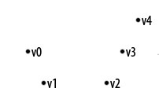

### GL_LINE_STRIP

绘制一系列线段。

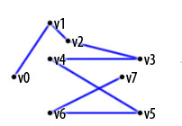

### GL_LINE_LOOP

类同上，但是首尾相连，构成一个封闭曲线。

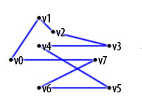

### GL_LINES

顶点两两连接，为多条线段构成。

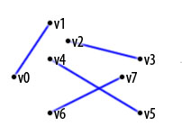

### GL_TRIANGLES

每隔三个顶点构成一个三角形，为多个三角形组成。   
  
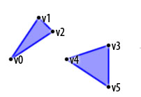

### GL_TRIANGLE_STRIP

每相邻三个顶点组成一个三角形，为一系列相接三角形构成。

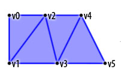

### GL_TRIANGLE_FAN

以一个点为三角形公共顶点，组成一系列相邻的三角形。

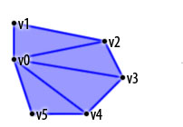

下面可以来绘制正方形了，在项目中添加一个 Square.java 定义如下：

```
package se.jayway.opengl.tutorial;
import java.nio.ByteBuffer;
import java.nio.ByteOrder;
import java.nio.FloatBuffer;
import java.nio.ShortBuffer;
import javax.microedition.khronos.opengles.GL10;
public class Square {
 // Our vertices.
 private float vertices[] = {
 -1.0f,  1.0f, 0.0f,  // 0, Top Left
 -1.0f, -1.0f, 0.0f,  // 1, Bottom Left
 1.0f, -1.0f, 0.0f,  // 2, Bottom Right
 1.0f,  1.0f, 0.0f,  // 3, Top Right
 };
 // The order we like to connect them.
 private short[] indices = { 0, 1, 2, 0, 2, 3 };
 // Our vertex buffer.
 private FloatBuffer vertexBuffer;
 // Our index buffer.
 private ShortBuffer indexBuffer;
 public Square() {
 // a float is 4 bytes, therefore we
 // multiply the number if
 // vertices with 4.
 ByteBuffer vbb
 = ByteBuffer.allocateDirect(vertices.length * 4);
 vbb.order(ByteOrder.nativeOrder());
 vertexBuffer = vbb.asFloatBuffer();
 vertexBuffer.put(vertices);
 vertexBuffer.position(0);
 // short is 2 bytes, therefore we multiply
 //the number if
 // vertices with 2.
 ByteBuffer ibb
 = ByteBuffer.allocateDirect(indices.length * 2);
 ibb.order(ByteOrder.nativeOrder());
 indexBuffer = ibb.asShortBuffer();
 indexBuffer.put(indices);
 indexBuffer.position(0);
 }
 /**
 * This function draws our square on screen.
 * @param gl
 */
 public void draw(GL10 gl) {
 // Counter-clockwise winding.
 gl.glFrontFace(GL10.GL_CCW);
 // Enable face culling.
 gl.glEnable(GL10.GL_CULL_FACE);
 // What faces to remove with the face culling.
 gl.glCullFace(GL10.GL_BACK);
 // Enabled the vertices buffer for writing
 //and to be used during
 // rendering.
 gl.glEnableClientState(GL10.GL_VERTEX_ARRAY);
 // Specifies the location and data format of
 //an array of vertex
 // coordinates to use when rendering.
 gl.glVertexPointer(3, GL10.GL_FLOAT, 0,
 vertexBuffer);
 gl.glDrawElements(GL10.GL_TRIANGLES, indices.length
 GL10.GL_UNSIGNED_SHORT, indexBuffer);
 // Disable the vertices buffer.
 gl.glDisableClientState(GL10.GL_VERTEX_ARRAY);
 // Disable face culling.
 gl.glDisable(GL10.GL_CULL_FACE);
 }
}  
```  

在 OpenGLRenderer 中添加 Square 成员变量并初始化：

```
// Initialize our square.
Square square = new Square();  
```  

并在 public void onDrawFrame(GL10 gl) 添加

```
// Draw our square.
square.draw(gl);  
```

来绘制这个正方形，编译运行，什么也没显示，这是为什么呢？这是因为 OpenGL ES 从当前位置开始渲染，缺省坐标为(0,0,0)，和 View port 的坐标一样，相当于把画面放在眼前，对应这种情况 OpenGL 不会渲染离 view Port 很近的画面，因此我们需要将画面向后退一点距离：

```
// Translates 4 units into the screen.
gl.glTranslatef(0, 0, -4);  
```  

在编译运行，这次倒是有显示了，当正方形迅速后移直至看不见，这是因为每次调用onDrawFrame 时，每次都再向后移动4个单位，需要加上重置 Matrix 的代码。

```
// Replace the current matrix with the identity matrix
gl.glLoadIdentity();  
```  

最终 onDrawFrame 的代码如下：

```
public void onDrawFrame(GL10 gl) {
 // Clears the screen and depth buffer.
 gl.glClear(GL10.GL_COLOR_BUFFER_BIT |
 GL10.GL_DEPTH_BUFFER_BIT);
 gl.glLoadIdentity();
 gl.glTranslatef(0, 0, -4);
 // Draw our square.
 square.draw(gl); // ( NEW )
}  
```  
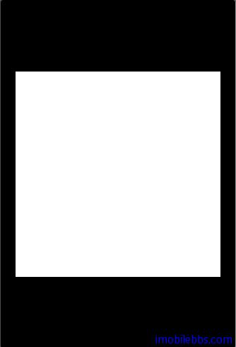  

本篇代码[下载](http://www.imobilebbs.com/download/android/opengles/OpenGLESTutorial1)