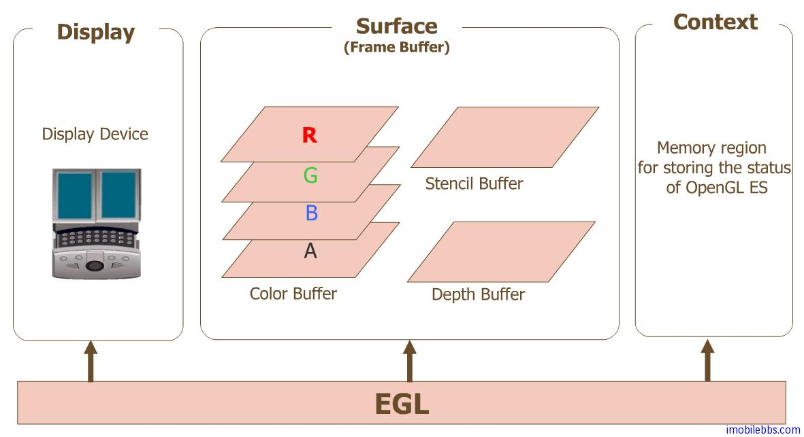

# 关于EGL  
  
OpenGL ES 的 javax.microedition.khronos.opengles 包定义了平台无关的 GL 绘图指令，EGL(javax.microedition.khronos.egl )
则定义了控制 displays ,contexts 以及surfaces 的统一的平台接口。

* Display(EGLDisplay) 是对实际显示设备的抽象。
* Surface（EGLSurface）是对用来存储图像的内存区域FrameBuffer的抽象，包括Color Buffer, Stencil Buffer ,Depth Buffer.
* Context (EGLContext) 存储 OpenGL ES绘图的一些状态信息。  

使用EGL的绘图的一般步骤：

1. 获取 EGLDisplay 对象
2. 初始化与 EGLDisplay 之间的连接。
3. 获取 EGLConfig 对象
4. 创建 EGLContext 实例
5. 创建 EGLSurface 实例
6. 连接 EGLContext 和 EGLSurface.
7. 使用 GL 指令绘制图形
8. 断开并释放与 EGLSurface 关联的 EGLContext 对象
9. 删除 EGLSurface 对象
10. 删除 EGLContext 对象
11. 终止与 EGLDisplay 之间的连接。  

一般来说在 Android 平台上开发 OpenGL ES 应用，无需直接使用javax.microedition.khronos.egl 包中的类按照上述步骤来使用 OpenGL ES 绘制图形，在Android 平台中提供了一个 android.opengl 包，类 GLSurfaceView 提供了对Display,Surface,Context 的管理，大大简化了 OpenGL ES 的程序框架,对应大部分 OpenGL ES 开发，只需调用一个方法来设置 OpenGLView 用到的 GLSurfaceView.Renderer。可以参见

[Android OpenGL ES 简明开发教程二：构造OpenGL ES View](http://www.imobilebbs.com/wordpress/archives/1508)