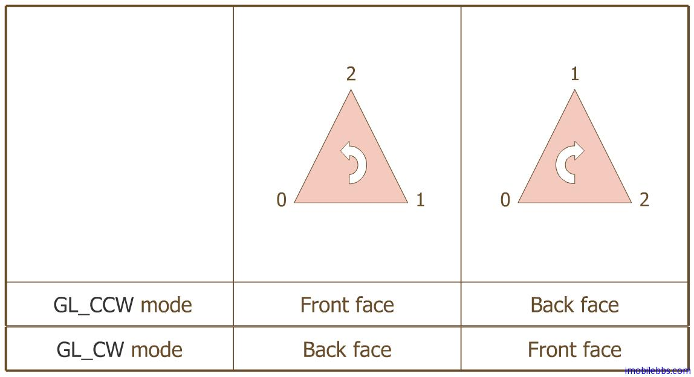

# 定义3D模型的前面和后面  
  
OpenGL ES 使用也只能使用三角形来定义一个面(Face)，为了获取绘制的高性能，一般情况不会同时绘制面的前面和后面，只绘制面的“前面”。虽然“前面”“后面”的定义可以应人而易，但一般为所有的“前面”定义统一的顶点顺序(顺时针或是逆时针方向）。 只绘制“前面”的过程称为”Culling”。

下面代码设置逆时针方法为面的“前面”：
  
```
gl.glFrontFace(GL10.GL_CCW);  
```  

打开 忽略“后面”设置：
  
```
gl.glEnable(GL10.GL_CULL_FACE);
```  
  
明确指明“忽略“哪个面的代码如下：
  
```
gl.glCullFace(GL10.GL_BACK);
```    



 