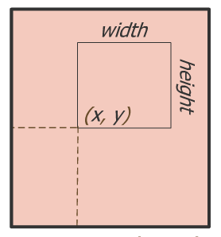

# Viewport变换  
  
摄影师调整好相机和被拍摄物体的位置角度（modelview) ，对好焦距（projection)后，就可以按下快门拍照了，拍好的照片可以在计算机上使用照片浏览器查看照片，放大，缩小，拉伸，并可以将照片显示窗口在屏幕上任意拖放。对应到3D绘制就是 Viewport 变换，目前的显示器大多还是2D的，viewport（显示区域）为一个长方形区域，并且使用屏幕坐标系来定义：  
  


OpenGL ES 中使用 glViewport() 来定义显示视窗的大小和位置：
  
```
glViewport(int x, int y, int width, int height)
```  
  
  

Android 缺省将 viewport 设置成和显示屏幕大小一致。

如果投影变换的宽度/高度比 (aspect) 和最后的 Viewport 的 width/height 比不一致的话，最后显示的图形就可能需要拉伸以适应 Viewport,从而可能造成图像变形。比如：现在的电视的显示模式有4:3 和 16:9 或是其它模式，如果使用16:9的模式来显示原始宽高比为4：3的视频，图像就有变形。  
  


## Z 坐标变换

前面提到的 modelview, projection 变换 同样应用于 Z 轴坐标，但和屏幕坐标系中 x,y 坐标不同的时，在屏幕坐标系下 ,Android OpenGL ES 将 z 坐标重新编码，它的值总会在0.0到1.0之间。作为深度 depth 测试的依据。

我们在示例代码的 OpenGLRenderer 的 onSurfaceChanged 使用和屏幕一样大小的区域作为Viewport，你也可以通过 glViewport 将视窗设成屏幕的局部某个区域。

并且可以看到透视投影的 aspect 为 width/height ，因此最后的图形不会有变形：

查看源代码打印帮助
  
```
public void onSurfaceChanged(GL10 gl, int width, int height) {
 // Sets the current view port to the new size.
 gl.glViewport(0, 0, width, height);
 // Select the projection matrix
 gl.glMatrixMode(GL10.GL\_PROJECTION);
 // Reset the projection matrix
 gl.glLoadIdentity();
 // Calculate the aspect ratio of the window
 GLU.gluPerspective(gl, 45.0f,
 (float) width / (float) height,
 0.1f, 100.0f);
 // Select the modelview matrix
 gl.glMatrixMode(GL10.GL_MODELVIEW);
 // Reset the modelview matrix
 gl.glLoadIdentity();
}
```