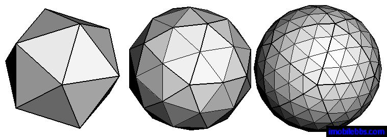
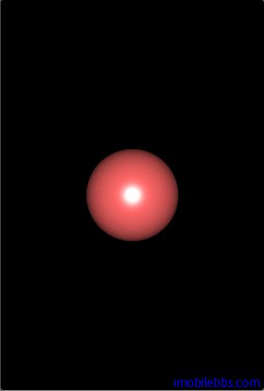

# 绘制一个球体  
  
OpenGL ES 只能通过绘制三角形来构造几何图形，比如前面绘制的20面体 [Android OpenGL ES 开发教程(12)：绘制一个20面体](http://www.imobilebbs.com/wordpress/archives/1970)，通过增加正多面体的边数，就可以构造出一个球体：  
  


在项目中创建一个 Sphere 类，它的 Draw 方法，通过绘制三角形来构造球体，并且为其添加法线，法线主要用于光照效果，将在后面介绍。

```
public void draw(GL10 gl) {
 float    theta, pai;
 float    co, si;
 float    r1, r2;
 float    h1, h2;
 float    step = 2.0f;
 float[][] v = new float[32][3];
 ByteBuffer vbb;
 FloatBuffer vBuf;
 vbb = ByteBuffer.allocateDirect(v.length \* v[0].length \* 4);
 vbb.order(ByteOrder.nativeOrder());
 vBuf = vbb.asFloatBuffer();
 gl.glEnableClientState(GL10.GL\_VERTEX\_ARRAY);
 gl.glEnableClientState(GL10.GL\_NORMAL\_ARRAY);
 for (pai = -90.0f; pai < 90.0f; pai += step) {
 int    n = 0;
 r1 = (float)Math.cos(pai \* Math.PI / 180.0);
 r2 = (float)Math.cos((pai + step) \* Math.PI / 180.0);
 h1 = (float)Math.sin(pai \* Math.PI / 180.0);
 h2 = (float)Math.sin((pai + step) \* Math.PI / 180.0);
 for (theta = 0.0f; theta <= 360.0f; theta += step) {
 co = (float)Math.cos(theta \* Math.PI / 180.0);
 si = -(float)Math.sin(theta \* Math.PI / 180.0);
 v[n][0] = (r2 \* co);
 v[n][1] = (h2);
 v[n][2] = (r2 \* si);
 v[n + 1][0] = (r1 \* co);
 v[n + 1][1] = (h1);
 v[n + 1][2] = (r1 \* si);
 vBuf.put(v[n]);
 vBuf.put(v[n + 1]);
 n += 2;
 if(n>31){
 vBuf.position(0);
 gl.glVertexPointer(3, GL10.GL\_FLOAT, 0, vBuf);
 gl.glNormalPointer(GL10.GL\_FLOAT, 0, vBuf);
 gl.glDrawArrays(GL10.GL\_TRIANGLE\_STRIP, 0, n);
 n = 0;
 theta -= step;
 }
 }
 vBuf.position(0);
 gl.glVertexPointer(3, GL10.GL\_FLOAT, 0, vBuf);
 gl.glNormalPointer(GL10.GL\_FLOAT, 0, vBuf);
 gl.glDrawArrays(GL10.GL\_TRIANGLE\_STRIP, 0, n);
 }
 gl.glDisableClientState(GL10.GL\_VERTEX\_ARRAY);
 gl.glDisableClientState(GL10.GL\_NORMAL\_ARRAY);
}  
```  

有了 Sphere 类，创建一个 DrawSphere Activity 来绘制球体，为了能看出3D效果，给场景中添加光源（后面介绍）

```
public void DrawScene(GL10 gl) {
 super.DrawScene(gl);
 initScene(gl);
 sphere.draw(gl);
}  
```  
  
  

本例[下载](http://www.imobilebbs.com/download/android/opengles/drawsphere.zip)