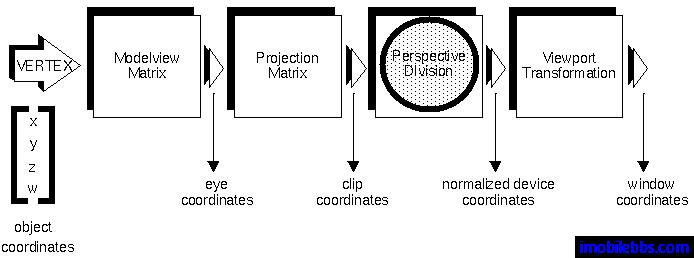
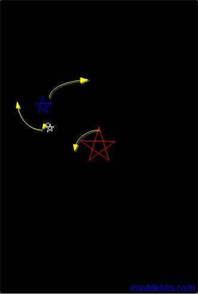

# 绘制迷你太阳系  
  
前面介绍了3D坐标系统和3D坐标变换以及在 OpenGL ES 中坐标变换的过程，并与相机拍照片的过程做类比，以便更好的理解这 OpenGL 中构造3D模型的一部步骤：  
  


本例提供绘制一个迷你太阳系系统作为前面知识的总结，这个迷你太阳系，有一个红色的太阳，一个蓝色的地图和一个白色的月亮构成：

* 太阳居中，逆时针自转。
* 地球绕太阳顺时针公转，本身不自转。
* 月亮绕地球顺时针公转，自身逆时针自转。  

为简单起见，使用一个2D五角星做为天体而没有使用球体（绘制球体在后面有介绍），构造一个Star类:
  
```
public class Star {
 // Our vertices.
 protected float vertices[];
 // Our vertex buffer.
 protected FloatBuffer vertexBuffer;
 public Star() {
 float a=(float)(1.0f/(2.0f-2f\*Math.cos(72f\*Math.PI/180.f)));
 float bx=(float)(a\*Math.cos(18\*Math.PI/180.0f));
 float by=(float)(a\*Math.sin(18\*Math.PI/180f));
 float cy=(float)(-a \* Math.cos(18\*Math.PI/180f));
 vertices=new float[]{
 0,a,0.5f,cy,-bx,by,bx,by,-0.5f,cy
 };
 ByteBuffer vbb
 = ByteBuffer.allocateDirect(vertices.length \* 4);
 vbb.order(ByteOrder.nativeOrder());
 vertexBuffer = vbb.asFloatBuffer();
 vertexBuffer.put(vertices);
 vertexBuffer.position(0);
 }
 /**
 * This function draws our star on screen.
 * @param gl
 */
 public void draw(GL10 gl) {
 // Counter-clockwise winding.
 gl.glFrontFace(GL10.GL\_CCW);
 // Enable face culling.
 gl.glEnable(GL10.GL\_CULL\_FACE);
 // What faces to remove with the face culling.
 gl.glCullFace(GL10.GL\_BACK);
 // Enabled the vertices buffer for writing
 //and to be used during
 // rendering.
 gl.glEnableClientState(GL10.GL\_VERTEX\_ARRAY);
 // Specifies the location and data format of
 //an array of vertex
 // coordinates to use when rendering.
 gl.glVertexPointer(2, GL10.GL\_FLOAT, 0,
 vertexBuffer);
 gl.glDrawArrays(GL10.GL_LINE_LOOP, 0,5);
 // Disable the vertices buffer.
 gl.glDisableClientState(GL10.GL\_VERTEX\_ARRAY);
 // Disable face culling.
 gl.glDisable(GL10.GL\_CULL\_FACE);
 }
}  
```  

Star定义了五角星的五个顶点，并使用 glDrawArrays 来绘制五角星，因此 vertices 顶点的顺序比较重要。

然后定义一个 DrawSolarSystem 来绘制这个迷你太阳系：
  
```
public class DrawSolarSystem extends OpenGLESActivity
 implements IOpenGLDemo{
 private Star sun=new Star();
 private Star earth=new Star();
 private Star moon=new Star();
 private int angle=0;
 /** Called when the activity is first created. */
 \@Override
 public void onCreate(Bundle savedInstanceState) {
 super.onCreate(savedInstanceState);
 }
 public void DrawScene(GL10 gl) {
 super.DrawScene(gl);
 gl.glLoadIdentity();
 GLU.gluLookAt(gl,0.0f, 0.0f, 15.0f,
 0.0f, 0.0f, 0.0f,
 0.0f, 1.0f, 0.0f);
 // Star A
 // Save the current matrix.
 gl.glPushMatrix();
 // Rotate Star A counter-clockwise.
 gl.glRotatef(angle, 0, 0, 1);
 gl.glColor4f(1.0f, 0.0f, 0.0f, 1.0f);
 // Draw Star A.
 sun.draw(gl);
 // Restore the last matrix.
 gl.glPopMatrix();
 // Star B
 // Save the current matrix
 gl.glPushMatrix();
 // Rotate Star B before moving it,
 //making it rotate around A.
 gl.glRotatef(-angle, 0, 0, 1);
 // Move Star B.
 gl.glTranslatef(3, 0, 0);
 // Scale it to 50% of Star A
 gl.glScalef(.5f, .5f, .5f);
 gl.glColor4f(0.0f, 0.0f, 1.0f, 1.0f);
 // Draw Star B.
 earth.draw(gl);
 // Star C
 // Save the current matrix
 gl.glPushMatrix();
 // Make the rotation around B
 gl.glRotatef(-angle, 0, 0, 1);
 gl.glTranslatef(2, 0, 0);
 // Scale it to 50% of Star B
 gl.glScalef(.5f, .5f, .5f);
 // Rotate around it's own center.
 gl.glRotatef(angle\*10, 0, 0, 1);
 gl.glColor4f(1.0f, 1.0f, 1.0f, 1.0f);
 // Draw Star C.
 moon.draw(gl);
 // Restore to the matrix as it was before C.
 gl.glPopMatrix();
 // Restore to the matrix as it was before B.
 gl.glPopMatrix();
 // Increse the angle.
 angle++;
 }
}
```  

使用 GLU 的 gluLookAt 来定义 modelview Matrix ，把相机放在正对太阳中心(0,0,0)，距离15 (0,0,15)。

使用 glPushMatrix 和 glPopMatrix 来将当前 Matrix 入栈或是出栈。

首先将当前 matrix 入栈，以红色绘制太阳，并逆向转动，将当前 matrix 入栈的目的是在能够在绘制地球时恢复当前栈。

然后绘制地球，使用局部坐标系来想象地球和太阳之间的相对运动，地球离开一距离绕太阳公转，相当于先旋转地球的局部坐标系，然后再平移地球的局部坐标系。对应到代码为先 glRotatef ,然后 glTranslate.

最后是绘制月亮，使用类似的空间想象方法。  
  


本例[下载](http://www.imobilebbs.com/download/android/opengles/drawsolarsystem.zip)