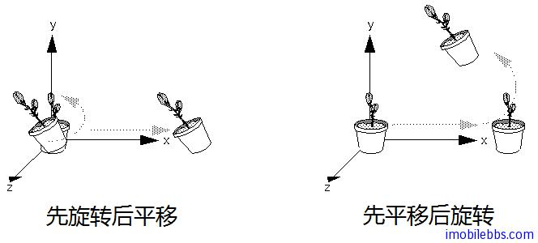
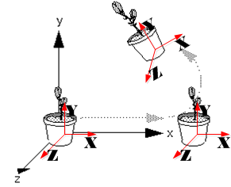
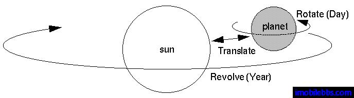
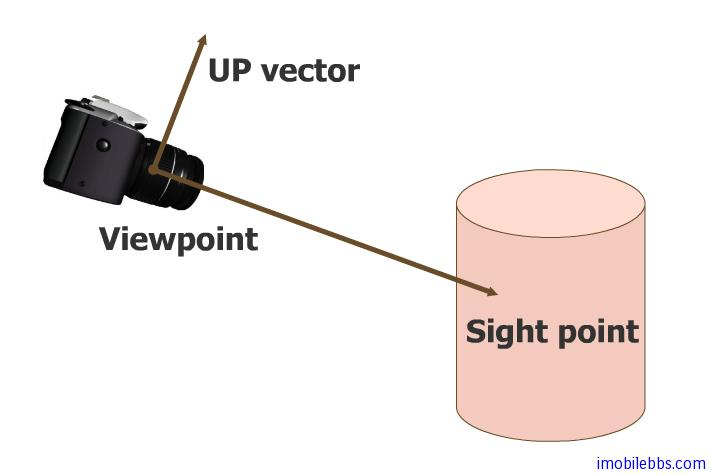

# Viewing和Modeling(MODELVIEW) 变换  
  
Viewing 和 Modeling 变换关系紧密，对应到相机拍照为放置三角架和调整被拍物体位置及角度，通常将这两个变换使用一个 modelview 变换矩阵来定义。对于同一个坐标变换，可以使用不同的方法来想象这个变换，比如将相机向某个方向平移一段距离，效果等同于将被拍摄的模型(model)向相反的方向平移同样的距离（相对运动）。两个不同的空间想象方法对于理解坐标变换各有其优缺点。你可以使用适合自己理解能力的方法来想象空间坐标变换。

下面我们使用一个由两个坐标变换组成的简单例子开始介绍 MODELVIEW 变换：一个变换为逆时针绕Z轴旋转45度，另一个变换为为沿X轴平移。 假定需要绘制的物体的尺寸和平移的距离相比要小的多从而你可以跟容易的看到平移效果。这个物体初始位置在坐标系的原点。

如果先旋转物体然后再平移，旋转后的物体的位置在 X 轴上面，但如果先平移后绕原点旋转物体，最终物体会出现在 y=x 的直线上：  
  


可以看到坐标变换的次序直接影响到最终的变换结果。所有的 Viewing 和 Modeling 变换操作都可以使用一个4X4 的矩阵来表示，所有后续的 glMultMatrix*() 或其它坐标变换指令 会使用一个新的变换矩阵M于当前 modelview 矩阵C相乘得到一个新的变换矩阵 CM。然后所有顶点坐标v 都会和这个新的变换矩阵相乘。 这个过程意味着最后发出的坐标变换指令实际上是第一个应用到顶点上的:CMv 。因此一种来理解坐标变换次序的方法是：使用逆序来指定坐标变换。

比如下面代码：

```
gl.glMatrixMode(GL_MODELVIEW);
gl.glLoadIdentity();
//apply transformation N
gl.glMultMatrixf(N);
//apply transformation M
glMultMatrixf(M);
//apply transformation L
gl.glMultMatrixf(L);
//draw vertex
...  
```  

上面代码, modelview 矩阵依次为I（单位矩阵）,N,NM 最终为 NML ，最终坐标变换的结果为 NMLv ，也就是N(M(Lv)) ，v 首先与 L 相乘，结果 Lv 再和M相乘，所得结果 MLv 再和N相乘。可以看到坐标变换的次序和指令指定的次序正好相反。而实际代码运行时，坐标无需进行三次变换运算，顶点 v 只需和计算出的最终变换矩阵 NML 相乘一次就可以了。

因此如果你采用世界坐标系（原点和X，Y，Z轴方向固定）来思考坐标变换，代码中坐标变换指令的次序和 顶点和矩阵相乘的次序相反。比如，还是上面的例子，如果你想最终的物体出现在X轴上，此时必须是先旋转后平移，可以使用如下代码（R 代表选择矩阵，T 代表平移矩阵）

```
gl.glMatrixMode(GL_MODELVIEW);
gl.glLoadIdentity();
//translation
gl.glMultMatrixf(T);
//rotation
gl.glMultMatrixf(R);
draw_the_object()  
```  

另外一种想象坐标变换的方法是忘记这种固定的坐标系统，而是使用物体本身的局部坐标系统，这种局部坐标系和物体的相对位置是固定的。 所有的坐标变换操作都是针对物体的局部坐标系。使用这种方法，代码中矩阵相乘的次序和相对局部坐标系坐标变换的次序是一致的。（不关使用哪种方法来想象坐标变换，最终同样变换结果代码都是一样的，只是理解的方法不同）。还是使用上面旋转平移的例子。想象一个和物体连接一起的局部坐标系，如下图红色的坐标系，想象所有的坐标变换都是相对这个局部坐标系的，要使物体最终出现在 y=x 上，可以想象先转动物体及其局部坐标系(R)，然后再平移物体及其局部坐标系（T),这时代码的顺序和相对于物体局部坐标系的次序是相同的。

```
gl.glMatrixMode(GL_MODELVIEW);
gl.glLoadIdentity();
//rotation
gl.glMultMatrixf(R);
//translation
gl.glMultMatrixf(T);
draw_the_object()  
```  
  

使用物体局部坐标系，可以更好的了解理解如机械手和太阳系之类的图形系统。
  
  

Android OpenGL ES 的 GLU 包有一个辅助函数 gluLookAt 提供一个更直观的方法来设置modelview 变换矩阵：
  
```
void gluLookAt(GL10 gl, float eyeX, float eyeY, float eyeZ, float centerX, float centerY, float centerZ, float upX, float upY, float upZ)
```  
  


* eyex,eyey,eyez 指定观测点的空间坐标。
* tarx,tary,tarz ，指定被观测物体的参考点的坐标。
* upx,upy,upz 指定观测点方向为“上”的向量。  

注意: 这些坐标都采用世界坐标系。