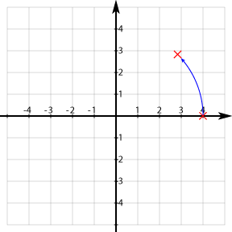

# 通用的矩阵变换指令  
  
Android OpenGL ES 对于不同坐标系下坐标变换，大都使用矩阵运算的方法来定义和实现的。这里介绍对应指定的坐标系（比如viewmodel, projection或是viewport) Android OpenGL ES支持的一些矩阵运算及操作。

OpenGL ES 中使用四个分量(x,y,z,w)来定义空间一个点，使用4个分量来描述3D坐标称为齐次坐标 ：所谓齐次坐标就是将一个原本是n维的向量用一个n+1维向量来表示。 它有什么优点呢？ 　　许多图形应用涉及到几何变换，主要包括平移、旋转、缩放。以矩阵表达式来计算这些变换时，平移是矩阵相加，旋转和缩放则是矩阵相乘，综合起来可以表示为p’ = m1\*p + m2(m1旋转缩放矩阵， m2为平移矩阵， p为原向量 ，p’为变换后的向量)。引入齐次坐标的目的主要是合并矩阵运算中的乘法和加法，表示为p’ = M\*p的形式。即它提供了用矩阵运算把二维、三维甚至高维空间中的一个点集从一个坐标系变换到另一个坐标系的有效方法。 　　它可以表示无穷远的点。n+1维的齐次坐标中如果h=0，实际上就表示了n维空间的一个无穷远点。对于齐次坐标[a,b,h]，保持a,b不变，|V|=（x1*x1，y1*y1,z1*z1)^1/2的过程就表示了标准坐标系中的一个点沿直线 ax+by=0 逐渐走向无穷远处的过程。

为了实现 viewing, modeling, projection 坐标变换，需要构造一个4X4 的矩阵 M，对应空间中任意一个顶点 vertex v , 经过坐标变换后的坐标 v’=Mv

矩阵本身可以支持加减乘除，对角线全为1的4X4 矩阵成为单位矩阵 Identity Matrix 。

* 将当前矩阵设为单位矩阵的指令 为glLoadIdentity().
* 矩阵相乘的指令glMultMatrix*() 允许指定任意矩阵和当前矩阵相乘。
* 选择当前矩阵种类glMatrixMode().  OpenGL ES 可以运行指定GL_PROJECTION，GL_MODELVIEW等坐标系，后续的矩阵操作将针对选定的坐标。
* 将当前矩阵设置成任意指定矩阵glLoadMatrix*()
* 在栈中保存当前矩阵和从栈中恢复所存矩阵，可以使用glPushMatrix()和glPopMatrix()
* 特定的矩阵变换平移glTranslatef(),旋转glRotatef() 和缩放glScalef()    

OpenGL 使用了右手坐标系统，右手坐标系判断方法：在空间直角坐标系中，让右手拇指指向x轴的正方向，食指指向y轴的正方向，如果中指能指向z轴的正方向，则称这个坐标系为右手直角坐标系。

 

## Translate平移变换

方法 public abstract void glTranslatef (float x, float y, float z) 用于坐标平移变换。

在上个例子中我们把需要显示的正方形后移了4个单位，就是使用的坐标的平移变换，可以进行多次平移变换，其结果为多个平移矩阵的累计结果，矩阵的顺序不重要，可以互换。
  
   

## Rotate旋转

方法 public abstract void glRotatef(float angle, float x, float y, float z)用来实现选择坐标变换，单位为角度。 (x,y,z)定义旋转的参照矢量方向。多次旋转的顺序非常重要。
  
   

比如你选择一个骰子，首先按下列顺序选择3次：
  
```
gl.glRotatef(90f, 1.0f, 0.0f, 0.0f);
gl.glRotatef(90f, 0.0f, 1.0f, 0.0f);
gl.glRotatef(90f, 0.0f, 0.0f, 1.0f);
```  
   
     
然后打算逆向旋转回原先的初始状态，需要有如下旋转：
  
```
gl.glRotatef(90f, -1.0f, 0.0f, 0.0f);
gl.glRotatef(90f, 0.0f, -1.0f, 0.0f);
gl.glRotatef(90f, 0.0f, 0.0f, -1.0f);
```  
   

或者如下旋转：
 
```
gl.glRotatef(90f, 0.0f, 0.0f, -1.0f);
gl.glRotatef(90f, 0.0f, -1.0f, 0.0f);
gl.glRotatef(90f, -1.0f, 0.0f, 0.0f);  
```  

旋转变换 glRotatef(angle, -x, -y, -z) 和 glRotatef(-angle, x, y, z)是等价的，但选择变换的顺序直接影响最终坐标变换的结果。 角度为正时表示逆时针方向。

## Translate & Rotate （平移和旋转组合变换）

在对 Mesh（网格，构成三维形体的基本单位）同时进行平移和选择变换时，坐标变换的顺序也直接影响最终的结果。

比如：先平移后旋转， 旋转的中心为平移后的坐标。
  
   

先选择后平移： 平移在则相对于旋转后的坐标系：
  
   

一个基本原则是，坐标变换都是相对于变换的 Mesh 本身的坐标系而进行的。

## Scale（缩放）

方法 public abstract void glScalef (float x, float y, float z)用于缩放变换。

下图为使用 gl.glScalef(2f, 2f, 2f) 变换后的基本，相当于把每个坐标值都乘以2.
  
   

## Translate & Scale（平移和缩放组合变换）

同样当需要平移和缩放时，变换的顺序也会影响最终结果。

比如先平移后缩放：
    
```
gl.glTranslatef(2, 0, 0);
gl.glScalef(0.5f, 0.5f, 0.5f);
```  
  

如果调换一下顺序：
  
``` 
gl.glScalef(0.5f, 0.5f, 0.5f);
gl.glTranslatef(2, 0, 0);  
```  

结果就有所不同：
  
   

## 矩阵操作，单位矩阵

在进行平移，旋转，缩放变换时，所有的变换都是针对当前的矩阵（与当前矩阵相乘），如果需要将当前矩阵回复最初的无变换的矩阵，可以使用单位矩阵（无平移，缩放，旋转）。
  
```
public abstract void glLoadIdentity()。
```  

在栈中保存当前矩阵和从栈中恢复所存矩阵，可以使用
  
```
public abstract void glPushMatrix()
```  

和
   
```
public abstract void glPopMatrix()。
```  

在进行坐标变换的一个好习惯是在变换前使用 glPushMatrix 保存当前矩阵，完成坐标变换操作后，再调用 glPopMatrix 恢复原先的矩阵设置。