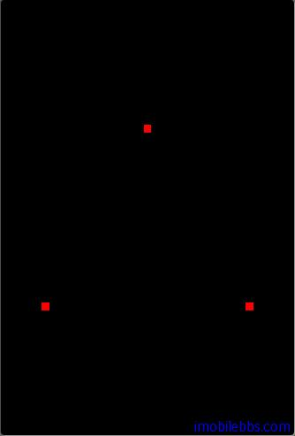

#  绘制点 Point 
   
上一篇介绍了 OpenGL ES 能够绘制的几种基本几何图形：点，线，三角形。将分别介绍这几种基本几何图形的例子。为方便起见，暂时在同一平面上绘制这些几何图形，在后面介绍完 OpenGL ES 的坐标系统和坐标变换后，再介绍真正的 3D 图形绘制方法。

[在 Android OpenGL ES 开发教程(7)：创建实例应用 OpenGLDemos 程序框架](http://www.imobilebbs.com/wordpress/archives/1892) 创建了示例应用的程序框架，并提供了一个“Hello World”示例。

为避免一些重复代码，这里定义一个所有示例代码的基类 OpenGLESActivity，其定义如下：

```
public class OpenGLESActivity extends Activity
 implements IOpenGLDemo{
 /** Called when the activity is first created. */
 @Override
 public void onCreate(Bundle savedInstanceState) {
 super.onCreate(savedInstanceState);
 this.requestWindowFeature(Window.FEATURE_NO_TITLE);
 getWindow().setFlags(
 WindowManager.LayoutParams.FLAG_FULLSCREEN,
 WindowManager.LayoutParams.FLAG_FULLSCREEN);
 mGLSurfaceView = new GLSurfaceView(this);
 mGLSurfaceView.setRenderer(new OpenGLRenderer(this));
 setContentView(mGLSurfaceView);
 }
 public void DrawScene(GL10 gl) {
 gl.glClearColor(0.0f, 0.0f, 0.0f, 0.0f);
 // Clears the screen and depth buffer.
 gl.glClear(GL10.GL_COLOR_BUFFER_BIT
 | GL10.GL_DEPTH_BUFFER_BIT);
 }
 @Override
 protected void onResume() {
 // Ideally a game should implement onResume() and onPause()
 // to take appropriate action when the activity looses focus
 super.onResume();
 mGLSurfaceView.onResume();
 }
 @Override
 protected void onPause() {
 // Ideally a game should implement onResume() and onPause()
 // to take appropriate action when the activity looses focus
 super.onPause();
 mGLSurfaceView.onPause();
 }
 protected GLSurfaceView mGLSurfaceView;
}  
```  

- 在onCreate 方法中创建一个 GLSurfaceView mGLSurfaceView，并将屏幕设置为全屏。并为mGLSurfaceView 设置 Render。
- onResume，onPause 处理 GLSurfaceView 的暂停和恢复。
- DrawScene 使用黑色清空屏幕。  

OpenGL ES 内部存放图形数据的 Buffer 有 COLOR ,DEPTH (深度信息）等，在绘制图形只前一般需要清空 COLOR 和 DEPTH Buffer。

本例在屏幕上使用红色绘制 3 个点。创建一个 DrawPoint 作为 OpenGLESActivity 的子类，并定义 3 个顶点的坐标：

```
public class DrawPoint extends OpenGLESActivity
 implements IOpenGLDemo{
 float[] vertexArray = new float[]{
 -0.8f , -0.4f * 1.732f , 0.0f ,
 0.8f , -0.4f * 1.732f , 0.0f ,
 0.0f , 0.4f * 1.732f , 0.0f ,
 };
 /** Called when the activity is first created. */
 @Override
 public void onCreate(Bundle savedInstanceState) {
 super.onCreate(savedInstanceState);
 }
 ...
}  
```  

下面为 DrawPoint 的 DrawScene 的实现：

```
public void DrawScene(GL10 gl) {
 super.DrawScene(gl);
 ByteBuffer vbb
 = ByteBuffer.allocateDirect(vertexArray.length*4);
 vbb.order(ByteOrder.nativeOrder());
 FloatBuffer vertex = vbb.asFloatBuffer();
 vertex.put(vertexArray);
 vertex.position(0);
 gl.glColor4f(1.0f, 0.0f, 0.0f, 1.0f);
 gl.glPointSize(8f);
 gl.glLoadIdentity();
 gl.glTranslatef(0, 0, -4);
 gl.glEnableClientState(GL10.GL_VERTEX_ARRAY);
 gl.glVertexPointer(3, GL10.GL_FLOAT, 0, vertex);
 gl.glDrawArrays(GL10.GL_POINTS, 0, 3);
 gl.glDisableClientState(GL10.GL_VERTEX_ARRAY);
}  
```  

- 首先是使用 FloatBuffer 存放三个顶点坐标。
- 使用 glColor4f(float red, float green, float blue, float alpha) 将当前颜色设为红色。
- glPointSize(float size) 可以用来设置绘制点的大小。
- 使用 glEnableClientState 打开 Pipeline 的Vectex 顶点“开关”
- 使用 glVertexPointer 通知 OpenGL ES 图形库顶点坐标。
- 使用 GL_POINTS 模式使用 glDrawArrays 绘制 3 个顶点。  
  
  

本例[下载](http://www.imobilebbs.com/download/android/opengles/drawpoint.zip)