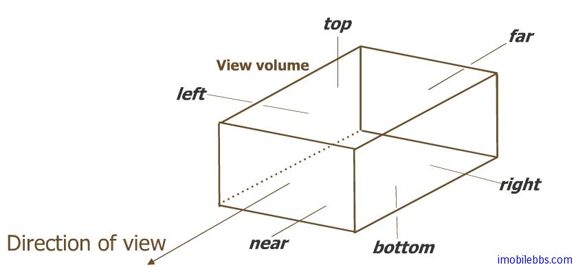

# 投影变换 Projection  
  
前面 ModelView 变换相当于拍照时放置相机和调整被拍物体的位置和角度。投影变换则对应于调整相机镜头远近来取景。

下面代码设置当前 Matrix 模式为 Projection 投影矩阵：
  
```
gl.glMatrixMode(GL_PROJECTION);
gl.glLoadIdentity();  
```  

后续的坐标变换则针对投影矩阵。投影变换的目的是定义视锥(viewing volume)，视锥一方面定义了物体如何投影到屏幕（如透视投影或是正侧投影），另一方面视锥也定义了裁剪场景的区域大小。

OpenGL ES 可以使用两种不同的投影变换：透视投影（Perspective Projection）和正侧投影（Orthographic Projection）。

## 透视投影(Perspective Projection)

透视投影的特点是“近大远小”，也就是我们眼睛日常看到的世界。OpenGL ES 定义透视投影的函数为 **glFrustum()**:
    
  

```
public void glFrustumf(float left,float right,float bottom,float top,float near,float far)
```  

视锥由(left,bottom,-near) 和(right,top,-near) 定义了靠近观测点的裁剪面,near 和far定义了观测点和两个创建面直接的近距离和远距离。

在实际写代码时，Android OpenGL ES提供了一个辅助方法gluPerspective()可以更简单的来定义一个透视投影变换:  


   
```
public static void gluPerspective(GL10 gl, float fovy, float aspect, float zNear, float zFar)
```   

- fovy: 定义视锥的 view angle.
- aspect:  定义视锥的宽高比。
- zNear: 定义裁剪面的近距离。
- zFar: 定义创建面的远距离。  

## 正侧投影(Orthographic Projection)

正侧投影，它的视锥为一长方体，特点是物体的大小不随到观测点的距离而变化，投影后可以保持物体之间的距离和夹角。它主要用在工程制图上。  
  


定义正侧投影（也称作平移投影）的函数为：
  
```
public void glOrthof(float left, float right,float bottom,float top,float near,float far)
```  

## 裁剪

场景中的图形的顶点经过 modelview 和 projection 坐标变换后，所有处在 Viewing volumn之外的顶点都会被裁剪掉，透视投影和正侧投影都有6个裁剪面。所有处在裁剪面外部的顶点都需剪裁掉以提高绘图性能。