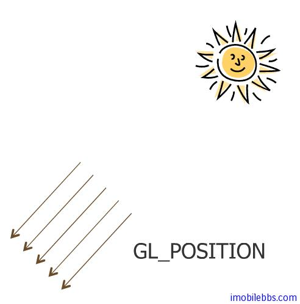
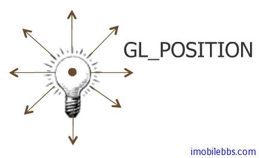
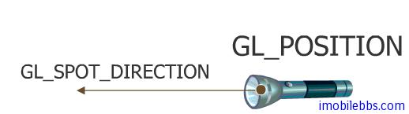
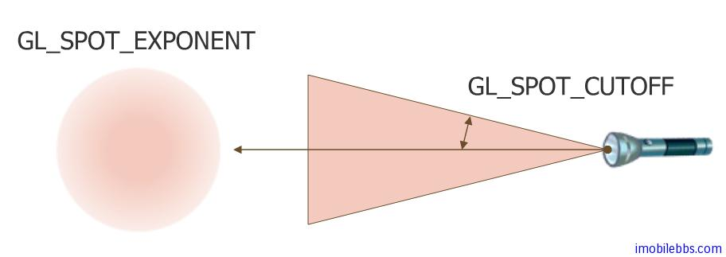
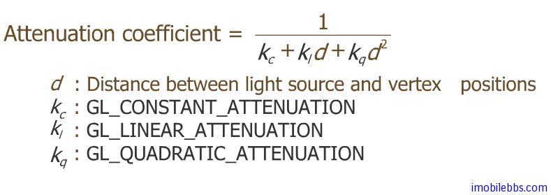
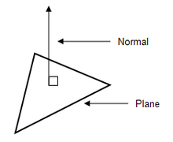

# 设置光照效果 Set Lighting  
  
上一篇简单介绍了 OpenGL 中使用的光照模型，本篇结合 OpenGL ES API 说明如何使用光照效果：

- 设置光源
- 定义法线
- 设置物体材料光学属性  

##光源

OpenGL ES 中可以最多同时使用八个光源，分别使用0到7表示。

OpenGL ES光源可以分为

- 平行光源(Parallel light source), 代表由位于无限远处均匀发光体，太阳可以近似控制平行光源。
- 点光源(Spot light source)如灯泡就是一个点光源，发出的光可以指向360度，可以为点光源设置光衰减属性（attenuation)或者让点光源只能射向某个方向（如射灯）。
- 可以为图形的不同部分设置不同的光源。  

下面方法可以打开某个光源，使用光源首先要开光源的总开关：

```
gl.glEnable(GL10.GL_LIGHTING);
```  
  
然后可以再打开某个光源如0号光源：

```
gl.glEnable(GL10.GL_LIGHTI0);
```  
  
设置光源方法如下：

- public void glLightfv(int light,int pname, FloatBuffer params)
- public void glLightfv(int light,int pname,float[] params,int offset)
- public void glLightf(int light,int pname,float param)
- light 指光源的序号，OpenGL ES可以设置从0到7共八个光源。
- pname: 光源参数名称，可以有如下：GL\_SPOT\_EXPONENT, GL\_SPOT\_CUTOFF, GL\_CONSTANT\_ATTENUATION,  GL\_LINEAR\_ATTENUATION, GL\_QUADRATIC\_ATTENUATION, GL\_AMBIENT, GL\_DIFFUSE,GL\_SPECULAR, GL\_SPOT\_DIRECTION, GL\_POSITION
- params 参数的值（数组或是Buffer类型）。  

其中为光源设置颜色的参数类型为 GL\_AMBIENT，GL\_DIFFUSE,GL\_SPECULAR，可以分别指定R,G,B,A 的值。

指定光源的位置的参数为 GL_POSITION,值为(x,y,z,w)：

平行光将 w 设为0.0，(x,y,z)为平行光的方向：  
  


对于点光源，将 w 设成非0值，通常设为1.0. (x,y,z)为点光源的坐标位置。
   

   
将点光源设置成聚光灯，需要同时设置 GL\_SPOT\_DIRECTION,GL\_SPOT\_CUTOFF 等参数，GL\_POSITION的设置和点光源类似：将 w 设成非0值，通常设为1.0. (x,y,z)为点光源的坐标位置。而对于GL\_SPOT\_DIRECTION 参数，设置聚光的方向(x,y,z)
  
  

GL\_SPOT\_CUTOFF 参数设置聚光等发散角度（0到90度）
  
  

GL\_SPOT\_EXPONENT 给出了聚光灯光源汇聚光的程度，值越大，则聚光区域越小（聚光能力更强）。
  
  

对应点光源（包括聚光灯），其它几个参数 GL\_CONSTANT\_ATTENUATION,  GL\_LINEAR\_ATTENUATION,  GL\_QUADRATIC\_ATTENUATION 为点光源设置光线衰减参数，公式有如下形式，一般无需详细了解：
  
  

在场景中设置好光源后，下一步要为所绘制的图形设置法线(Normal)，只有设置了法线，光源才能在所会物体上出现光照效果。三维平面的法线是垂直于该平面的三维向量。曲面在某点P处的法线为垂直于该点切平面的向量
  
  

和设置颜色类似，有两个方法可以为平面设置法线，一是
  
```
public void glNormal3f(float nx,float ny,float nz)
```  

这个方法为后续所有平面设置同样的方向，直到重新设置新的法线为止。

为某个顶点设置法线：
  
```
public void glNormalPointer(int type,int stride, Buffer pointer)
```  

- type  为Buffer 的类型，可以为GL_BYTE, GL_SHORT, GL_FIXED,或 GL_FLOAT
- stride: 每个参数之间的间隔，通常为0.
- pointer: 法线值。  

打开法线数组

```
gl.glEnableClientState(GL10.GL\_NORMAL\_ARRAY);  
```  

用法和 Color, Vertex 类似。参见 [Android OpenGL ES 开发教程(8)：基本几何图形定义](http://www.imobilebbs.com/wordpress/archives/1938)。

规范化法向量，比如使用坐标变换（缩放），如果三个方向缩放比例不同的话，顶点或是平面的法线可能就有变好，此时需要打开规范化法线设置：

```
gl.glEnable(GL10.GL\_NORMALIZE);  
```  

经过规范化后法向量为单位向量（长度为1）。同时可以打开缩放法线设置

```
gl.glEnable(GL10.GL\_RESCALE\_NORMAL);  
```  

设置好法线后，需要设置物体表面材料(Material)的反光属性（颜色和材质）。

将在下篇介绍设置物体表面材料(Material)的反光属性（颜色和材质）并给出一个光照的示例。