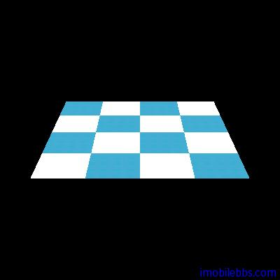

# 材质渲染 
  
前面讨论了如何给 3D 图形染色，更一般的情況是使用点阵图來给 Mesh 上色（渲染材质）。主要步骤如下：

## 创建 Bitmap 对象

使用材质渲染，首先需要构造用来渲染的 Bitmap 对象，Bitmap 对象可以从资源文件中读取或是从网路下载或是使用代码构造。为简单起见，本例从资源中读取：

```
Bitmap bitmap = BitmapFactory.decodeResource(contect.getResources(),
 R.drawable.icon);  
```  

要注意的是，有些设备对使用的 Bitmap 的大小有要求，要求 Bitmap 的宽度和长度为 2 的几次幂（1，2，4，8，16，32，64.。。。)，如果使用不和要求的 Bitmap 来渲染，可能只会显示白色。

## 创建材质(Generating a texture)

下一步使用 OpenGL 库创建一个材质(Texture)，首先是获取一個 Texture Id。

``` 
// Create an int array with the number of textures we want,
// in this case 1.
int[] textures = new int[1];
// Tell OpenGL to generate textures.
gl.glGenTextures(1, textures, 0);  
```  

textures 中存放了创建的 Texture ID，使用同样的 Texture Id ，也可以来刪除一个 Texture：

```
// Delete a texture.
gl.glDeleteTextures(1, textures, 0)  
```  

有了 Texture Id 之后，就可以通知 OpenGL 库使用这个 Texture：

```
gl.glBindTexture(GL10.GL_TEXTURE_2D, textures[0]);  
```  

## 设置 Texture 参数 glTexParameter

下一步需要給 Texture 填充设置参数，用来渲染的 Texture 可能比要渲染的区域大或者小，这是需要设置 Texture 需要放大或是缩小时 OpenGL 的模式：

```
// Scale up if the texture if smaller.
gl.glTexParameterf(GL10.GL_TEXTURE_2D,
 GL10.GL_TEXTURE_MAG_FILTER,
 GL10.GL_LINEAR);
// scale linearly when image smalled than texture
gl.glTexParameterf(GL10.GL_TEXTURE_2D,
 GL10.GL_TEXTURE_MIN_FILTER,
 GL10.GL_LINEAR);  
```  

常用的两种模式为 GL10.GL_LINEAR 和 GL10.GL_NEAREST。

需要比较清晰的图像使用 GL10.GL_NEAREST：  
  


而使用 GL10.GL_LINEAR 则会得到一个较模糊的图像：  
  


## UV Mapping

下一步要告知 OpenGL 库如何将 Bitmap 的像素映射到 Mesh 上。这可以分为两步来完成：

## 定义 UV 坐标

UV Mapping 指将 Bitmap 的像素映射到 Mesh 上的顶点。UV 坐标定义为左上角（0，0），右下角（1，1）（因为使用的 2D Texture)，下图坐标显示了 UV 坐标，右边為我们需要染色的平面的顶点順序：

为了能正确的匹配，需要把 UV 坐标中的（0，1）映射到顶点 0，（1，1）映射到顶点 2 等等。

```  
float textureCoordinates[] = {0.0f, 1.0f,
 1.0f, 1.0f,
 0.0f, 0.0f,
 1.0f, 0.0f };  
```  
  
  

如果使用如下坐标定义：

```  
float textureCoordinates[] = {0.0f, 0.5f,
 0.5f, 0.5f,
 0.0f, 0.0f,
 0.5f, 0.0f };  
```  
  
  

Texture 匹配到 Plane 的左上角部分。

而

```
float textureCoordinates[] = {0.0f, 2.0f,
 2.0f, 2.0f,
 0.0f, 0.0f,
 2.0f, 0.0f };  
```  

將使用一些不存在的 Texture 去渲染平面(UV 坐标为 0，0-1，1 而 (0,0)-(2,2)定义超过 UV 定义的大小），这时需要告诉 OpenGL 库如何去渲染这些不存在的 Texture 部分。

有两种設置

* GL_REPEAT 重复 Texture。
* GL_CLAMP_TO_EDGE 只靠边线复制一次。  
* 
下面有四种不同組合：   
  


本例使用如下配置：

```  
gl.glTexParameterf(GL10.GL_TEXTURE_2D,
 GL10.GL_TEXTURE_WRAP_S,
 GL10.GL_REPEAT);
gl.glTexParameterf(GL10.GL_TEXTURE_2D,
 GL10.GL_TEXTURE_WRAP_T,
 GL10.GL_REPEAT);  
```  

然后是将 Bitmap 资源和 Texture 绑定起來：

```
GLUtils.texImage2D(GL10.GL_TEXTURE_2D, 0, bitmap, 0);  
```  

## 使用 Texture

为了能够使用上面定义的 Texture，需要创建一 Buffer 來存储 UV 坐标：

```
FloatBuffer byteBuf = ByteBuffer.allocateDirect(texture.length * 4);
byteBuf.order(ByteOrder.nativeOrder());
textureBuffer = byteBuf.asFloatBuffer();
textureBuffer.put(textureCoordinates);
textureBuffer.position(0);  
```  

## 渲染

```
// Telling OpenGL to enable textures.
gl.glEnable(GL10.GL_TEXTURE_2D);
// Tell OpenGL where our texture is located.
gl.glBindTexture(GL10.GL_TEXTURE_2D, textures[0]);
// Tell OpenGL to enable the use of UV coordinates.
gl.glEnableClientState(GL10.GL_TEXTURE_COORD_ARRAY);
// Telling OpenGL where our UV coordinates are.
gl.glTexCoordPointer(2, GL10.GL_FLOAT, 0, textureBuffer);
// ... here goes the rendering of the mesh ...
// Disable the use of UV coordinates.
gl.glDisableClientState(GL10.GL_TEXTURE_COORD_ARRAY);
// Disable the use of textures.
gl.glDisable(GL10.GL_TEXTURE_2D);   
```  

本例代码是在一个平面上（SimplePlane）下使用 Texture 来渲染，首先是修改 Mesh 基类，使它能够支持定义 UV 坐标：

```
// Our UV texture buffer.
private FloatBuffer mTextureBuffer;
/**
 * Set the texture coordinates.
 *
 * @param textureCoords
 */
protected void setTextureCoordinates(float[] textureCoords) {
 // float is 4 bytes, therefore we multiply the number if
 // vertices with 4.
 ByteBuffer byteBuf = ByteBuffer.allocateDirect(
 textureCoords.length * 4);
 byteBuf.order(ByteOrder.nativeOrder());
 mTextureBuffer = byteBuf.asFloatBuffer();
 mTextureBuffer.put(textureCoords);
 mTextureBuffer.position(0);
}  
```  

并添加设置 Bitmap 和创建 Texture 的方法：

```  
// Our texture id.
private int mTextureId = -1;
// The bitmap we want to load as a texture.
private Bitmap mBitmap;
/**
 * Set the bitmap to load into a texture.
 *
 * @param bitmap
 */
public void loadBitmap(Bitmap bitmap) {
 this.mBitmap = bitmap;
 mShouldLoadTexture = true;
}
/**
 * Loads the texture.
 *
 * @param gl
 */
private void loadGLTexture(GL10 gl) {
 // Generate one texture pointer...
 int[] textures = new int[1];
 gl.glGenTextures(1, textures, 0);
 mTextureId = textures[0];
 // ...and bind it to our array
 gl.glBindTexture(GL10.GL_TEXTURE_2D, mTextureId);
 // Create Nearest Filtered Texture
 gl.glTexParameterf(GL10.GL_TEXTURE_2D, GL10.GL_TEXTURE_MIN_FILTER,
 GL10.GL_LINEAR);
 gl.glTexParameterf(GL10.GL_TEXTURE_2D, GL10.GL_TEXTURE_MAG_FILTER,
 GL10.GL_LINEAR);
 // Different possible texture parameters, e.g. GL10.GL_CLAMP_TO_EDGE
 gl.glTexParameterf(GL10.GL_TEXTURE_2D, GL10.GL_TEXTURE_WRAP_S,
 GL10.GL_CLAMP_TO_EDGE);
 gl.glTexParameterf(GL10.GL_TEXTURE_2D, GL10.GL_TEXTURE_WRAP_T,
 GL10.GL_REPEAT);
 // Use the Android GLUtils to specify a two-dimensional texture image
 // from our bitmap
 GLUtils.texImage2D(GL10.GL_TEXTURE_2D, 0, mBitmap, 0);
}  
```  

最后修改 draw 方法來渲染材质：  

```
// Indicates if we need to load the texture.
private boolean mShouldLoadTexture = false;
/**
 * Render the mesh.
 *
 * @param gl
 *            the OpenGL context to render to.
 */
public void draw(GL10 gl) {
 ...
 // Smooth color
 if (mColorBuffer != null) {
 // Enable the color array buffer to be used during rendering.
 gl.glEnableClientState(GL10.GL_COLOR_ARRAY);
 gl.glColorPointer(4, GL10.GL_FLOAT, 0, mColorBuffer);
 }
 if (mShouldLoadTexture) {
 loadGLTexture(gl);
 mShouldLoadTexture = false;
 }
 if (mTextureId != -1 && mTextureBuffer != null) {
 gl.glEnable(GL10.GL_TEXTURE_2D);
 // Enable the texture state
 gl.glEnableClientState(GL10.GL_TEXTURE_COORD_ARRAY);
 // Point to our buffers
 gl.glTexCoordPointer(2, GL10.GL_FLOAT, 0, mTextureBuffer);
 gl.glBindTexture(GL10.GL_TEXTURE_2D, mTextureId);
 }
 gl.glTranslatef(x, y, z);
 ...
 // Point out the where the color buffer is.
 gl.glDrawElements(GL10.GL_TRIANGLES, mNumOfIndices,
 GL10.GL_UNSIGNED_SHORT, mIndicesBuffer);
 ...
 if (mTextureId != -1 && mTextureBuffer != null) {
 gl.glDisableClientState(GL10.GL_TEXTURE_COORD_ARRAY);
 }
 ...
}  
```  

本例使用的 SimplePlane 定义如下：

```
package se.jayway.opengl.tutorial.mesh;
/**
 * SimplePlane is a setup class for Mesh that creates a plane mesh.
 *
 * @author Per-Erik Bergman (per-erik.bergman@jayway.com)
 *
 */
public class SimplePlane extends Mesh {
 /**
 * Create a plane with a default with and height of 1 unit.
 */
 public SimplePlane() {
 this(1, 1);
 }
 /**
 * Create a plane.
 *
 * @param width
 *            the width of the plane.
 * @param height
 *            the height of the plane.
 */
 public SimplePlane(float width, float height) {
 // Mapping coordinates for the vertices
 float textureCoordinates[] = { 0.0f, 2.0f, //
 2.0f, 2.0f, //
 0.0f, 0.0f, //
 2.0f, 0.0f, //
 };
 short[] indices = new short[] { 0, 1, 2, 1, 3, 2 };
 float[] vertices = new float[] { -0.5f, -0.5f, 0.0f,
 0.5f, -0.5f, 0.0f,
 -0.5f,  0.5f, 0.0f,
 0.5f, 0.5f, 0.0f };
 setIndices(indices);
 setVertices(vertices);
 setTextureCoordinates(textureCoordinates);
 }
}  
```  


本例示例代码[下載](http://www.imobilebbs.com/download/android/opengles/OpenGLESTutorial4.zip) ，到本篇为止介紹了 OpenGL ES 开发的基本方法，更详细的教程将在以后发布，后面先回到 Android ApiDemos 中 OpenGL ES 的示例。