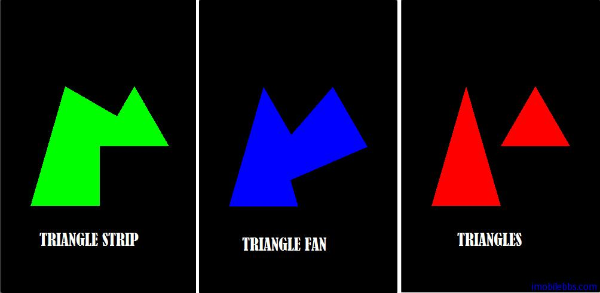

# 绘制三角形 Triangle  
   
三角形为 OpenGL ES 支持的面，同样创建一个 DrawTriangle Activity，定义 6 个顶点使用三种不同模式来绘制三角形：
  
```
float vertexArray[] = {
 -0.8f, -0.4f * 1.732f, 0.0f,
 0.0f, -0.4f * 1.732f, 0.0f,
 -0.4f, 0.4f * 1.732f, 0.0f,
 0.0f, -0.0f * 1.732f, 0.0f,
 0.8f, -0.0f * 1.732f, 0.0f,
 0.4f, 0.4f * 1.732f, 0.0f,
};  
```  

本例绘制
  
```
public void DrawScene(GL10 gl) {
 super.DrawScene(gl);
 ByteBuffer vbb
 = ByteBuffer.allocateDirect(vertexArray.length*4);
 vbb.order(ByteOrder.nativeOrder());
 FloatBuffer vertex = vbb.asFloatBuffer();
 vertex.put(vertexArray);
 vertex.position(0);
 gl.glLoadIdentity();
 gl.glTranslatef(0, 0, -4);
 gl.glEnableClientState(GL10.GL_VERTEX_ARRAY);
 gl.glVertexPointer(3, GL10.GL_FLOAT, 0, vertex);
 index++;
 index%=10;
 switch(index){
 case 0:
 case 1:
 case 2:
 gl.glColor4f(1.0f, 0.0f, 0.0f, 1.0f);
 gl.glDrawArrays(GL10.GL_TRIANGLES, 0, 6);
 break;
 case 3:
 case 4:
 case 5:
 gl.glColor4f(0.0f, 1.0f, 0.0f, 1.0f);
 gl.glDrawArrays(GL10.GL_TRIANGLE_STRIP, 0, 6);
 break;
 case 6:
 case 7:
 case 8:
 case 9:
 gl.glColor4f(0.0f, 0.0f, 1.0f, 1.0f);
 gl.glDrawArrays(GL10.GL_TRIANGLE_FAN, 0, 6);
 break;
 }
 gl.glDisableClientState(GL10.GL_VERTEX_ARRAY);
}  
``` 

这里 index 的目的是为了延迟一下显示（更好的做法是使用固定时间间隔）。前面说过 GLSurfaceView 的渲染模式有两种，一种是连续不断的更新屏幕，另一种为 on-demand ，只有在调用 requestRender() 在更新屏幕。 缺省为 RENDERMODE\_CONTINUOUSLY 持续刷新屏幕。

OpenGLDemos 使用的是缺省的 RENDERMODE\_CONTINUOUSLY 持续刷新屏幕 ，因此 Activity 的 drawScene 会不断的执行。本例中屏幕上顺序以红，绿，蓝色显示 TRIANGLES， TRIANGLE\_STRIP,TRIANGLE\_FAN。
  
 
